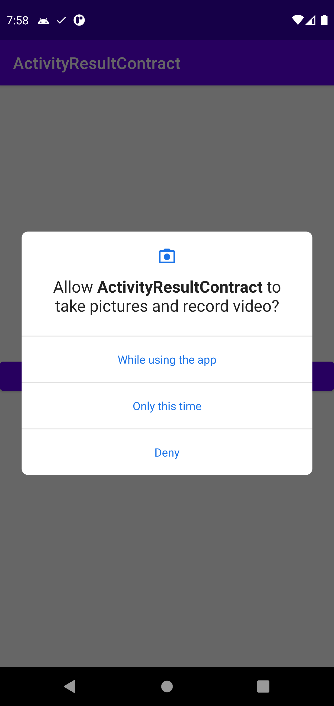
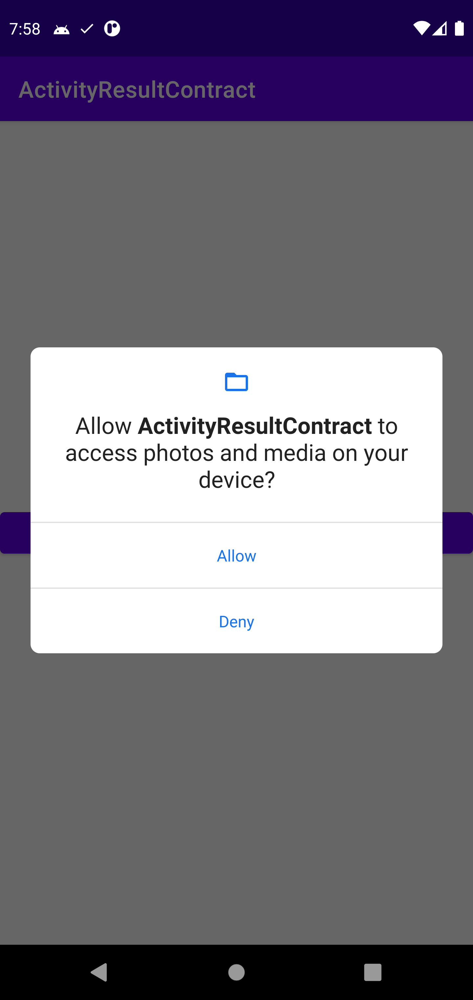
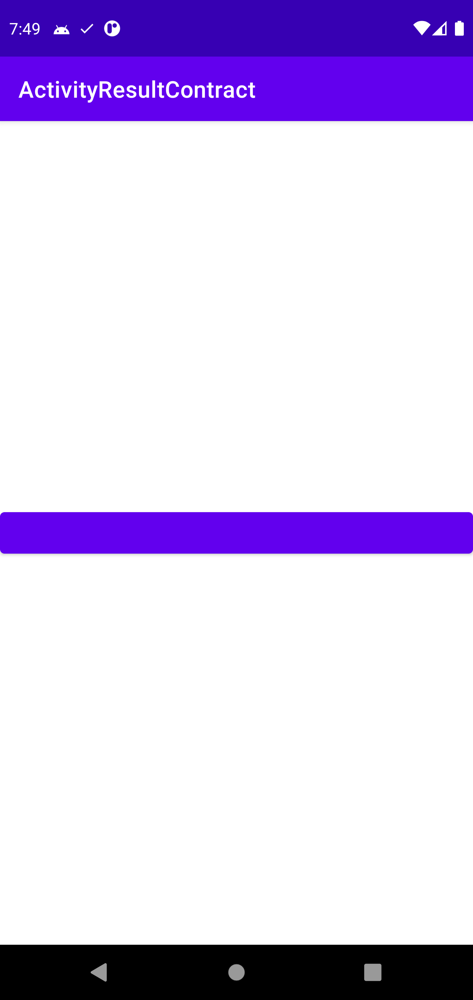
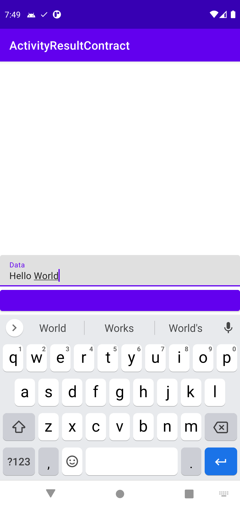
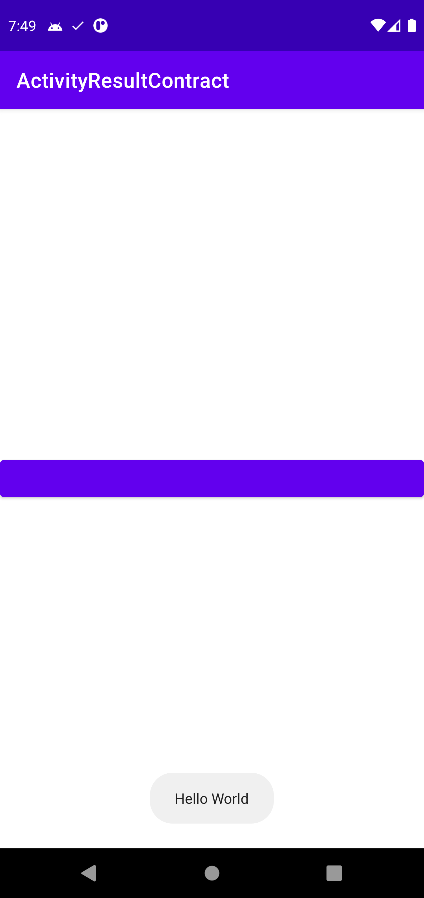

# ActivityResultContract 예제

## ⚡ Features
* StartActivityForResult : startActivityForResult가 Deprecated되면서 새로운 대안이다. (https://rkdxowhd98.tistory.com/175)

* RequestMultiplePermissions : Permission을 요구할 수 있다. (https://rkdxowhd98.tistory.com/175)

## 😊 Introduction
### RequestMultiplePermissions
* #### 여러 권한을 한번에 요청할 수 있다.

### StartActivityForResult
* #### startActivityForResult처럼 Activity의 결과를 얻을 수 있다.
