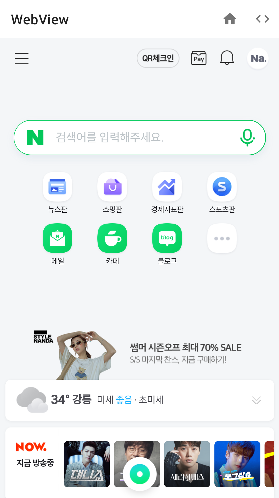
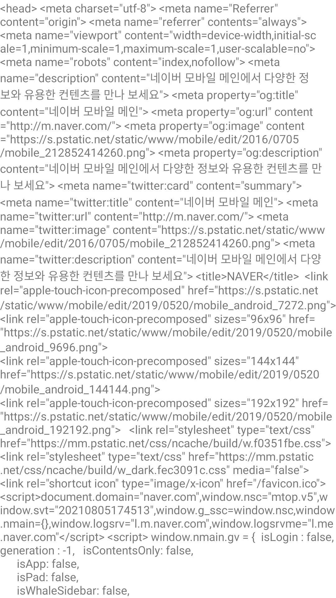

# Bridge 예제

## ⚡ Features
* Bridge : WebView에 addJavascriptInterface기능을 사용하여 JavaScript를 추가한 후 Web과 Android간 기능을 공유하는 방법이다. (https://rkdxowhd98.tistory.com/196)

## 😊 Introduction
* #### Bridge를 통해 HTML 소스를 불러오는 JavaScript를 포함 시키고, Callback 방식으로 전달 받는다.
