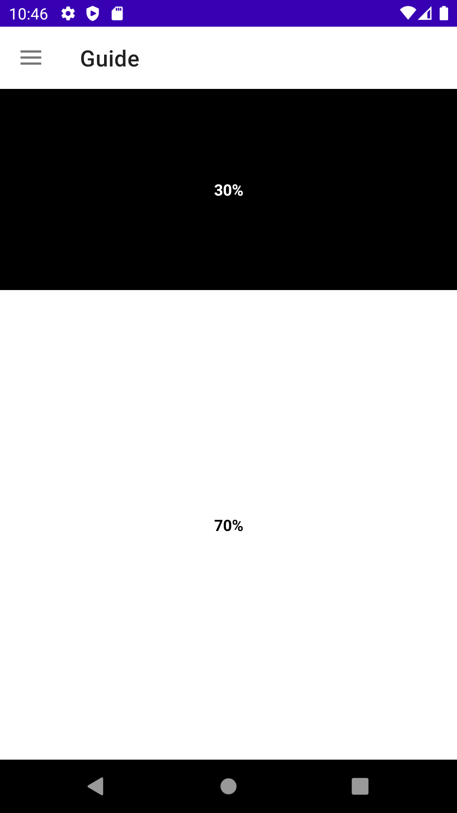
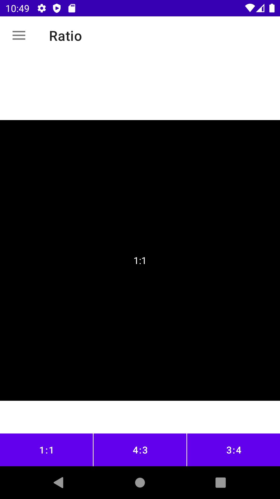
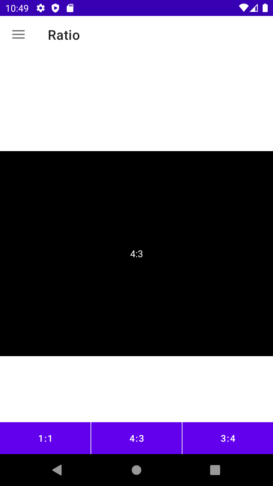
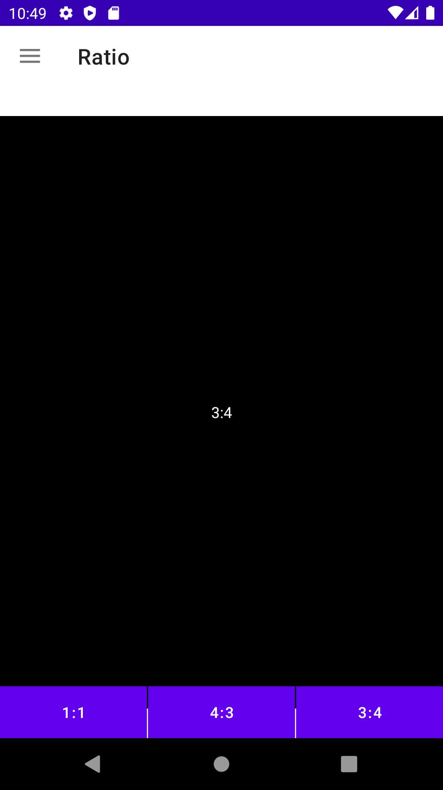
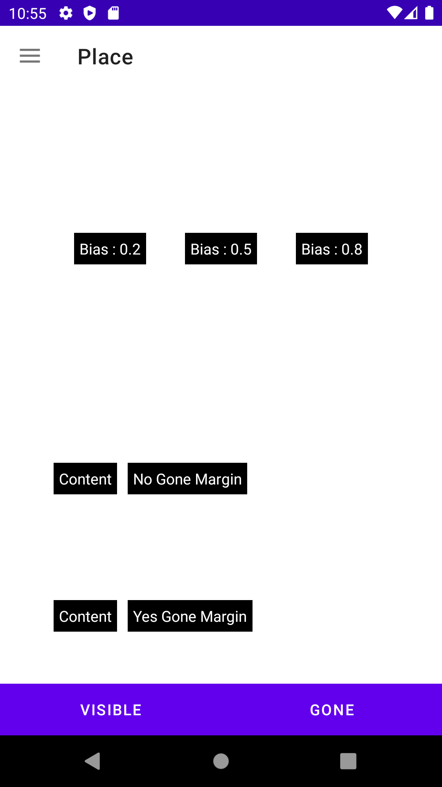
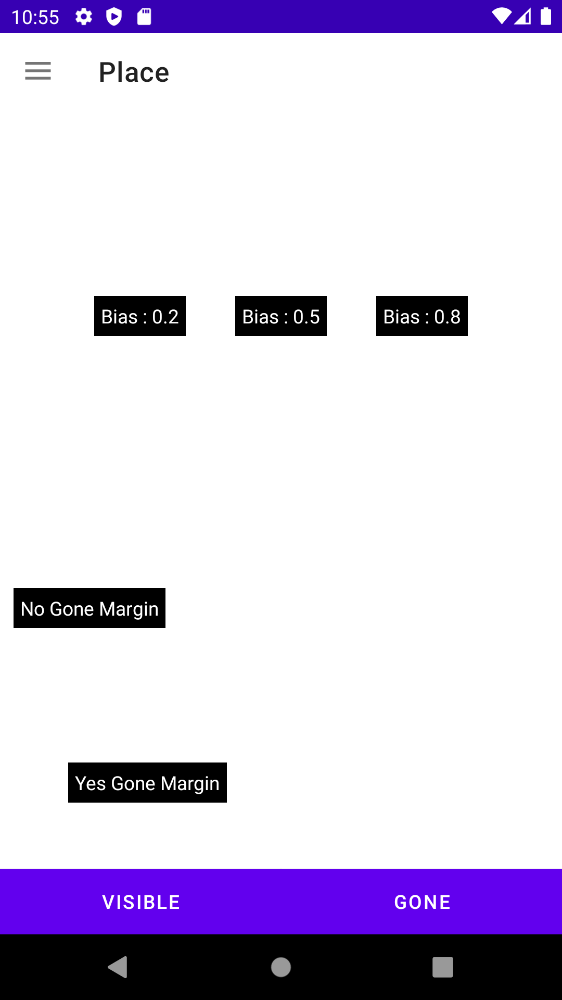

# ConstraintLayout 예제

## ⚡ Features
* Constraint : RelativeLayout처럼 관계를 설정하여 View를 위치시킬 수 있고, 여러 제약을 주면서 View를 가운데로 위치시킬 수 있다.(https://rkdxowhd98.tistory.com/83)

* Circle : Constraint를 Angle과 Radius를 통해 거리와 각도로 위치시킬 수 있다. (https://rkdxowhd98.tistory.com/83)

* Guide Line : Guide Line을 만들어서 Constraint를 좀 더 자유롭게 설정할 수 있고, Guide Line의 위치를 Start, End뿐만 아니라 Percent로 비율로 정할 수 있다. (https://rkdxowhd98.tistory.com/83)

* Chain : Chain 속성을 통해 Constraint로 서로 연관된 View의 위치를 다양하게 표현할 수 있으며 Weight 속성을 통해 LinearyLayout과 비슷한 효과를 낼 수 있다. (https://rkdxowhd98.tistory.com/83)

* Ratio : Ratio 기능을 통해 View의 Width, Height의 비율을 정할 수 있다. (https://rkdxowhd98.tistory.com/83)

* Place : Bias와 goneMargin을 통해 다이나믹한 상황에 맞게 View를 배치할 수 있다. (https://rkdxowhd98.tistory.com/83)

* Group : ConstraintLayout의 장점으로 여러 Layout을 사용해서 표현할 수 있던 상황을 ConstraintLayout을 사용하여 하나로 표현할 수 있는데 Group 기능을 통해 더욱 편리하게 Child View들을 관리할 수 있다. (https://rkdxowhd98.tistory.com/83)

## 😊 Introduction
### ConstraintFragment
* #### Constraint를 설정하여 View의 위치를 정할 수 있다.

### GuildFragment
* #### Guide Line을 만들어서 Constraint를 더욱 자세하게 설정할 수 있다.

### ChainFragment
* #### Chain을 설정하여 서로 Constraint가 된 View를 여러 방법으로 표현할 수 있다.
* #### Chain과 Weight를 설정하여 LinearLayout처럼 표현할 수 있다.

### RatioFragment
* #### Constraint를 설정하여 View의 위치를 정할 수 있다.

### PlaceFragment
* #### Bias를 통해 View의 위치를 Percent로 표현할 수 있다.
* #### goneMargin을 통해 Constraint 관계에 있는 View가 GONE일 상태에서 Margin을 설정할 수 있다.

