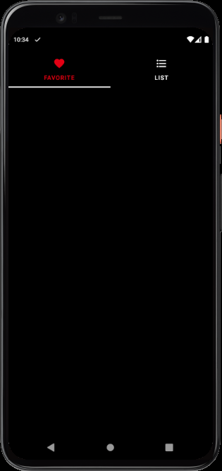

# CoordinatorLayout 예제

## ⚡ Features
* CoordinatorLayout : CoordinatorLayout을 사용하여 Scroll시 FloatingActionButton을 show() / hide()하는 코드와 AppBarLayout을 통해 View간의 상호작용하는 예제를 만들었습니다. (https://rkdxowhd98.tistory.com/119)

* AppBarLayout : CoordinatorLayout과 AppBarLayout을 사용하여 Scroll시 Fragment의 상단 부분에 효과를 줬습니다. (https://rkdxowhd98.tistory.com/120)

* CollapsingToolbarLayout : CollapsingToolbarLayout의 Title 기능과 CollapseMode를 사용하여 효과를 줬습니다. (https://rkdxowhd98.tistory.com/121)

* Anchor : CoordinatorLayout의 Anchor를 사용하여 FloatingActionButton의 위치를 표현했습니다. (https://rkdxowhd98.tistory.com/119)

* Behavior / Event : CoordinatorLayout과 Custom Behavior를 사용하여 Scroll시 FloatingActionButton을 show() / hide() 했습니다. (https://rkdxowhd98.tistory.com/122)

* Glide : ImageUrl을 통해 ImageView를 업데이트하는 라이브러리

## 😊 Introduction
### MainFragment
* #### ViewPager2와 TabLayout을 사용하여 Favortite / List를 표현했습니다.
* #### AppBarLayout의 enterAlways Scroll Flag를 사용하여 Scroll을 내리면 TabLayout을 사라지게 하고 Scroll을 올리면 TabLayout을 보이게 했습니다.

### FavoriteFragment
* #### InformationFragment에서 Favorite한 Movie만 나오게 했습니다.
* #### Glide를 사용하여 영화의 포스터를 ImageView에 업데이트하였습니다.

### ListFragment
* #### Movie를 RecyclerView의 StaggeredLayoutManager를 사용하여 표현했습니다.
* #### Glide를 사용하여 영화의 포스터를 ImageView에 업데이트하였습니다.

### InformationFragment
* #### Navigation을 통해 Movie를 arg로 받습니다.
* #### CollapsingToolbarLayout을 사용하여 Title을 표현하고 CollapseMode를 pin으로 설정하여 Collapse된 상태에서 Movie의 Title을 보여줍니다.
* #### FloatingActionButton에 Custom Behavior를 설정하여 Scroll을 내리면 숨기고 Scroll을 올리면 보이게 하였습니다.

