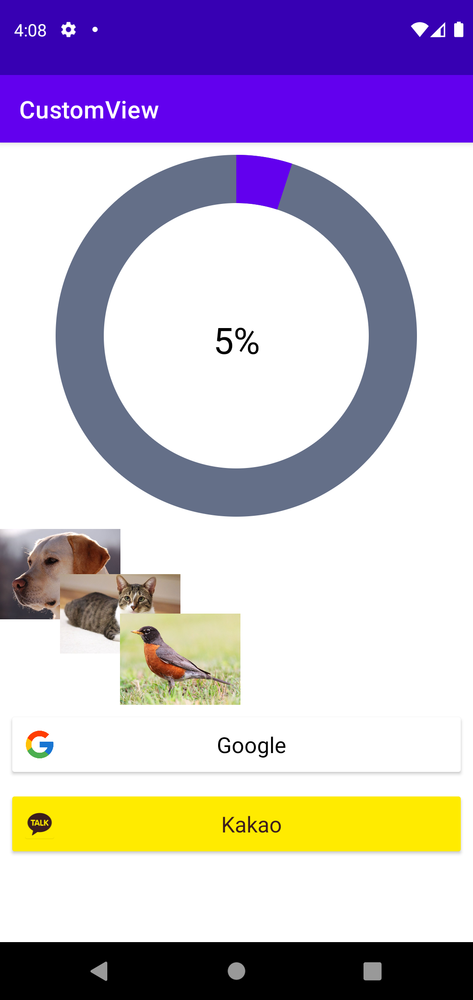
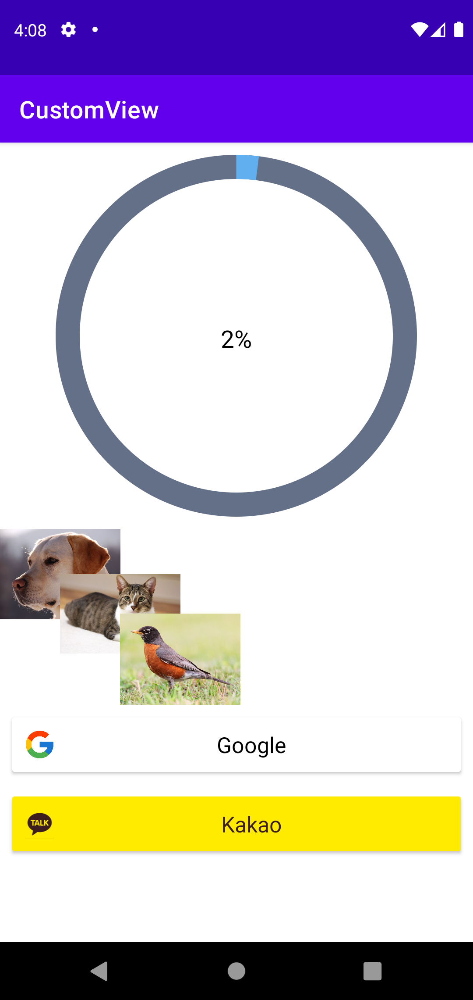

# CustomView 예제

## ⚡ Features
* AttributeSet : Android에서 View에 제공하는 AttributeSet을 통해 XML에서 쉽게 값을 수정할 수있습니다. (https://rkdxowhd98.tistory.com/162)

* MeasureSpec : CustomView를 만들기 위해 onMeasure 함수에서 MeasureSpec을 통해 크기를 측정해야합니다.  (https://rkdxowhd98.tistory.com/164)

* CustomView(ProgressView) : View를 상속받아서 onMeasure, onDraw를 재정의하여 ProgressView를 구현했습니다. (https://rkdxowhd98.tistory.com/163)

* CustomView(OverlapLayout) : ViewGroup을 상속받아서 onMeasure, onLayout을 재정의하여 OverlapLayout을 구현했습니다. (https://rkdxowhd98.tistory.com/165)

* CustomView(LoginButtonView) : MaterialCardView를 상속 받아서 구현했으며 merge 태그를 사용하여 Layout의 1 Depth를 줄였습니다. (https://rkdxowhd98.tistory.com/166)

## 😊 Introduction
### ScreenShot
* #### ProgressView : Value에 따라 자동으로 Progress가 진행되도록 구현
* #### OverlapLayout : ChildView가 겹치면서 표현되도록 구현
* #### LoginButtonView : XML에서 쉽게 icon, text, textColor, backgroundColor 등을 지정할 수 있도록 구현
