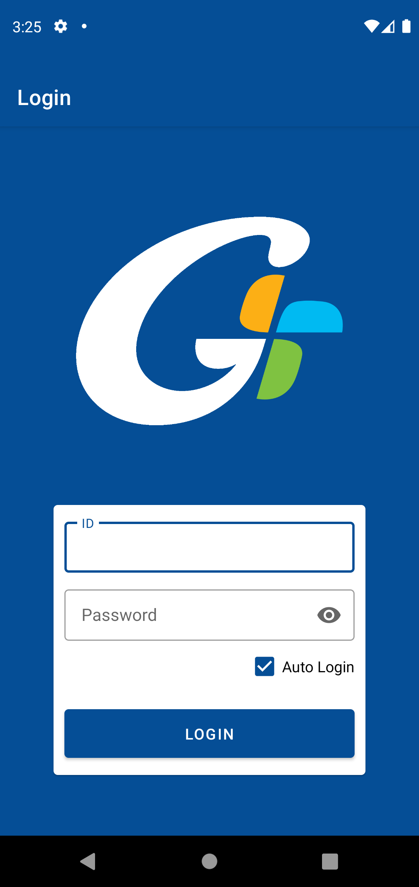
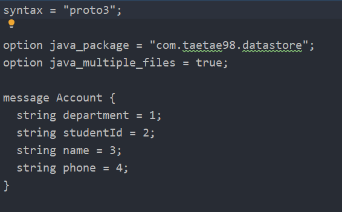
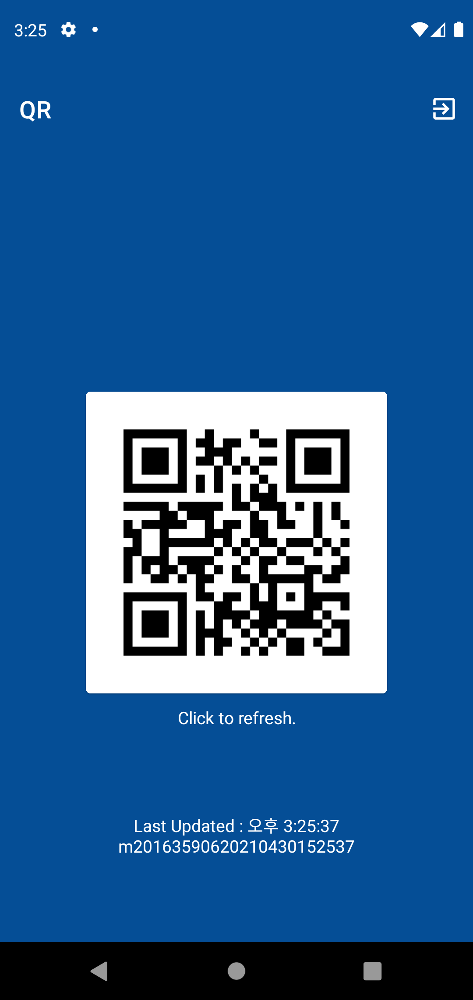

# DataStore 예제

## ⚡ Features
* Preferences DataStore : SharedPreferences처럼 Key-Value 구조로 데이터를 저장할 수 있습니다. 기존의 SharedPreferences는 XML 형태로 저장하기 때문에 get함수로 데이터를 읽을 때 UI Thread를 막고 apply함수로 값을 저장할 때 성공/실패 여부를 확인할 수 없는 문제점을 해결했습니다. (https://rkdxowhd98.tistory.com/148)

* Proto DataStore : ProtoBuffer언어를 사용하여 Primitive뿐만 아니라 Class형태로 값을 저장할 수 있다. (https://rkdxowhd98.tistory.com/148)

* QR : zxing 오픈소스를 이용하여 QR Code를 만들 수 있다. (https://rkdxowhd98.tistory.com/142)

## 😊 Introduction
### LoginFragment
* #### Login할 때 ID, Password, StudentID 등 필요한 정보를 Proto DataStore로 저장한다.
* #### 가천대학교 API를 통해 로그인 성공 여부를 확인한다.

### QRFragment
* #### Proto DataStore에서 저장된 값을 불러와 QR코드를 생성한다.
