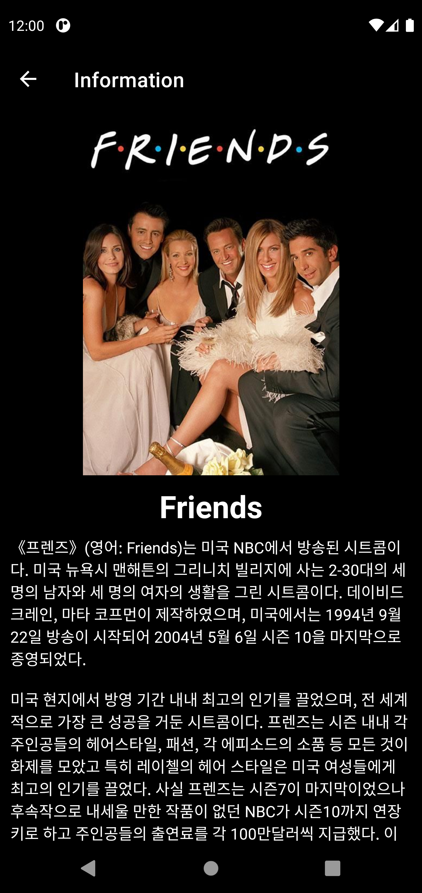
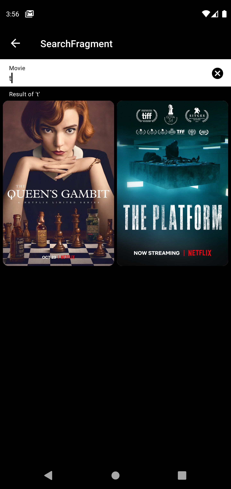
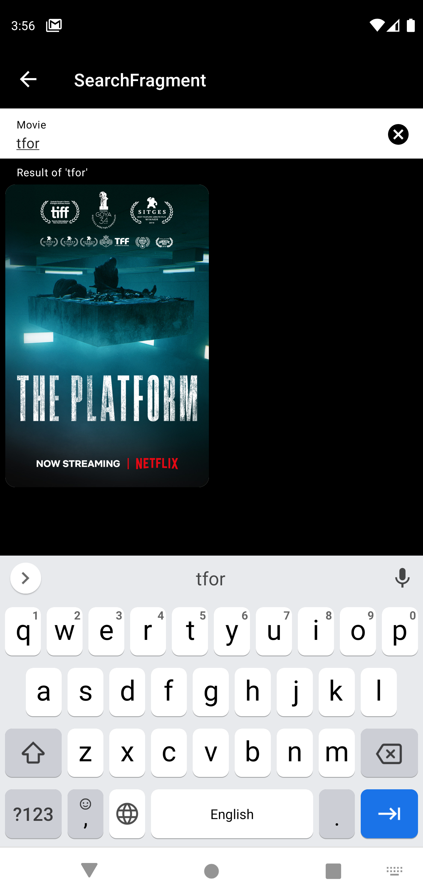

# DataBinding 예제

## ⚡ Features
* Base패턴을 사용하여 Activity, Fragment, View, Dialog, Holder등 바인딩 객체를 얻는 법을 사용했습니다. (https://rkdxowhd98.tistory.com/113)

* 바인딩 수식 : import, bind, default 등 바인딩 수식을 사용하여 Java와 Kotlin으로 View를 업데이트 하는 코드를 최소화 하였습니다. (https://rkdxowhd98.tistory.com/114)

* BindingAdapter : 바인딩 수식에서 제공하지 않는 것들을 BindingAdapter를 통해 Binding Function을 만들어서 Java와 Kotlin에서 View를 업데이트 하는 코드를 최소화 했습니다. (https://rkdxowhd98.tistory.com/115)

* 양방향 데이터 바인딩 : EditText, DatePicker, RatingBar 등 데이터가 변하는 View는 역으로 LiveData, ObservableField를 통해 바인딩 받을 수 있다. (https://rkdxowhd98.tistory.com/157)

* Glide : ImageUrl을 통해 ImageView를 업데이트하는 라이브러리

## 😊 Introduction
### MovieFragment
* #### RecyclerView StaggeredGridLayoutManager를 사용하여 영화 포스터마다 높이가 달라도 자연스럽게 표시하였습니다.
* #### Glide를 사용하여 영화의 포스터를 ImageView에 업데이트하였습니다.
* #### BindingAdapter를 사용하여 Glide를 Databinding으로 처리했습니다.

### InformationFragment
* #### navigation action을 통해 movie객체를 전달하고 Databinding을 통해서 UI를 업데이트 했습니다.
* #### movie는 Parcelable를 상속받아 구현하여 전달할 수 있게 만들었습니다.

### SearchFragment
* #### ViewModel + LiveData와 EditText를 양방향 데이터 바인딩했습니다.
* #### EditText의 값이 변할 때 LiveData의 Value가 변하면서 Observer가 실행됩니다.
* #### 검색값에 따라 TextInputLayout의 helperText변경과 RecyclerView의 목록을 업데이트합니다.
 