# Dialog 예제

## ⚡ Features
* DatePickerDialog : 달력으로 날짜를 선택하는 Dialog (https://rkdxowhd98.tistory.com/42)

* TimePickerDialog : 시계로 시간을 선택하는 Dialog (https://rkdxowhd98.tistory.com/42)

* AlertDialog : 알림창을 띄우는 Dialog (https://rkdxowhd98.tistory.com/42)

* SelectAlertDialog : AlertDialog를 활용한 하나의 Item을 선택하는 Dialog (https://rkdxowhd98.tistory.com/42)

* RadioAlertDialog : AlertDialog를 활용한 RadioButton으로 하나의 Item을 선택하는 Dialog (https://rkdxowhd98.tistory.com/42)

* CheckBoxAlertDailog : AlertDialog를 활용한 CheckBoxButton으로 여러 Item을 선택하는 Dialog (https://rkdxowhd98.tistory.com/42)

* CustomAlertDialog : AlertDialog를 활용하여 사용자가 정의한 Layout으로 Dialog를 만들 수 있다. (https://rkdxowhd98.tistory.com/42)

* CustomDialog : DialogFragment를 상속하여 사용자가 정의한 Layout으로 Dialog를 만들 수 있다. (https://rkdxowhd98.tistory.com/42)

## 😊 Introduction
### DatePickerDialog
* #### DatePickerDialog.OnDateSetListener를 사용하여 결과 값을 받을 수 있다.
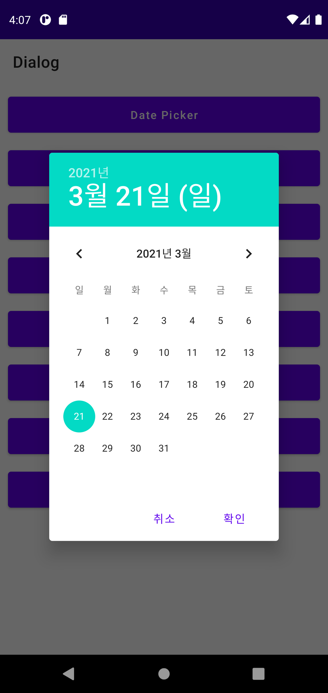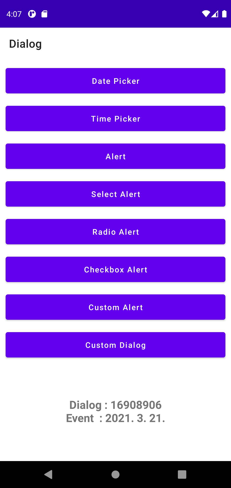

### TimePickerDialog
* #### TimePickerDialog.OnTimeSetListener를 사용하여 결과 값을 받을 수 있다.
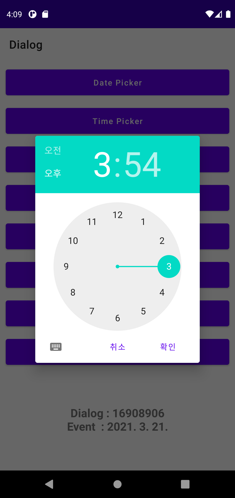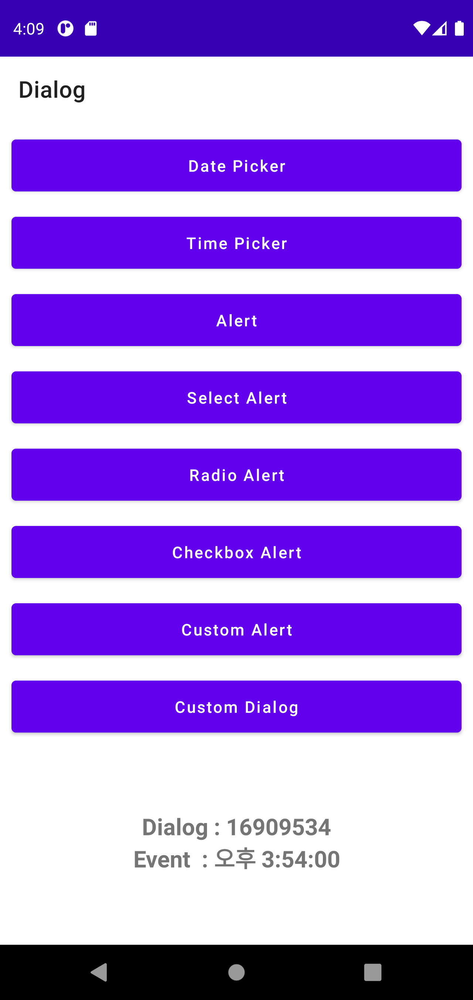

### AlertDialog
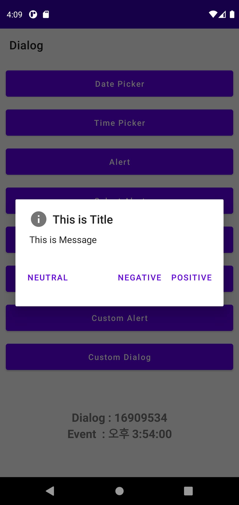

### SelectAlertDialog
* #### AlertDialog의 setItems를 사용하여 만들 수 있다.
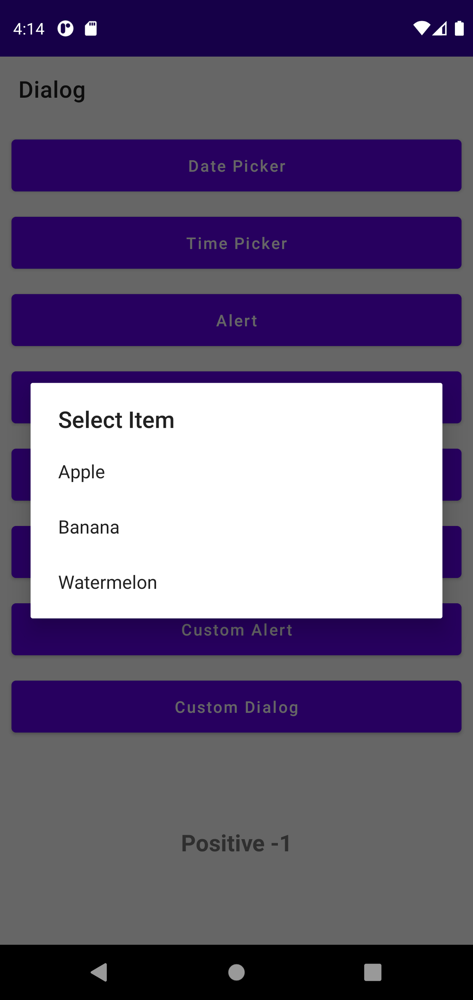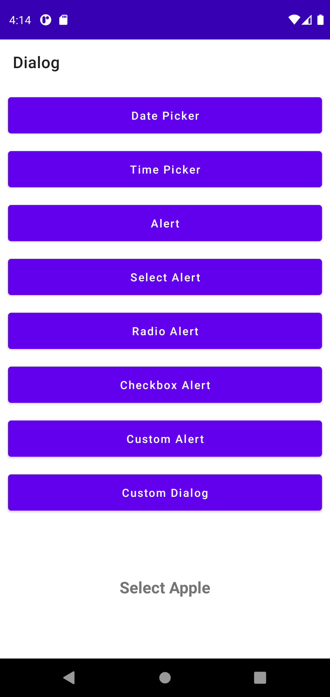

### RadioAlertDialog
* #### AlertDialog의 setSingleChoiceItems을 사용하여 만들 수 있다.
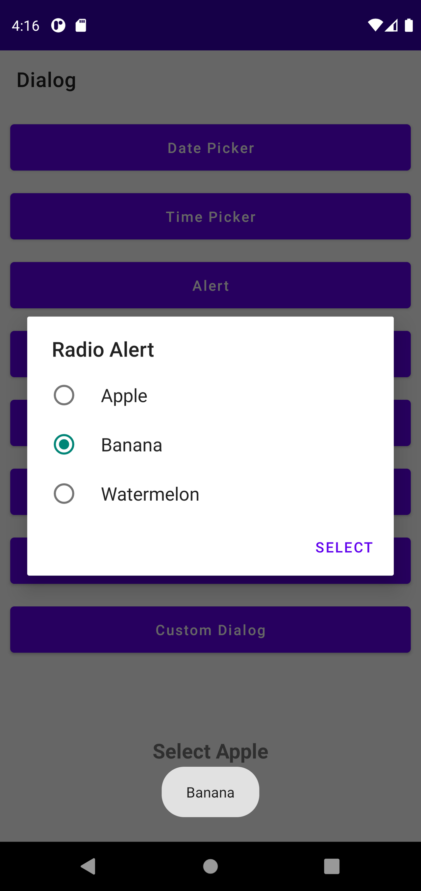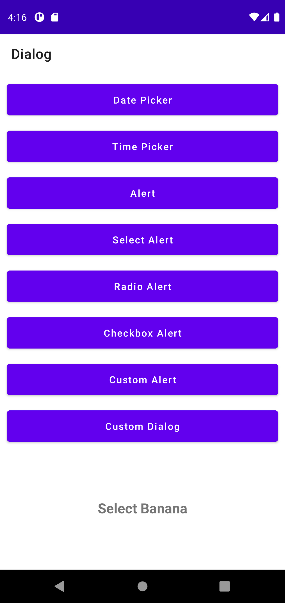

### CheckBoxAlertDailog
* #### AlertDialog의 setMultiChoiceItems을 사용하여 만들 수 있다.
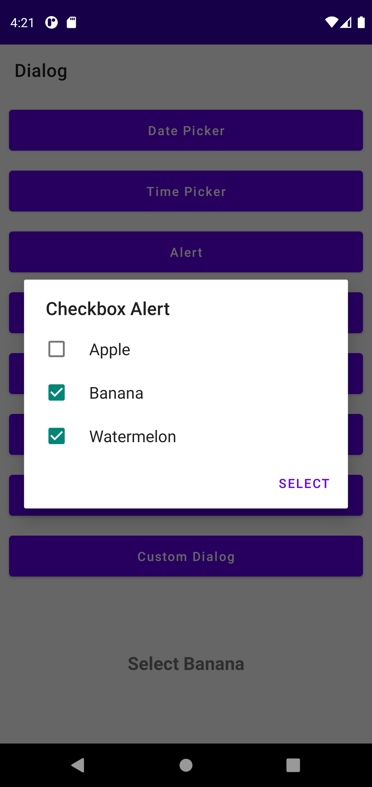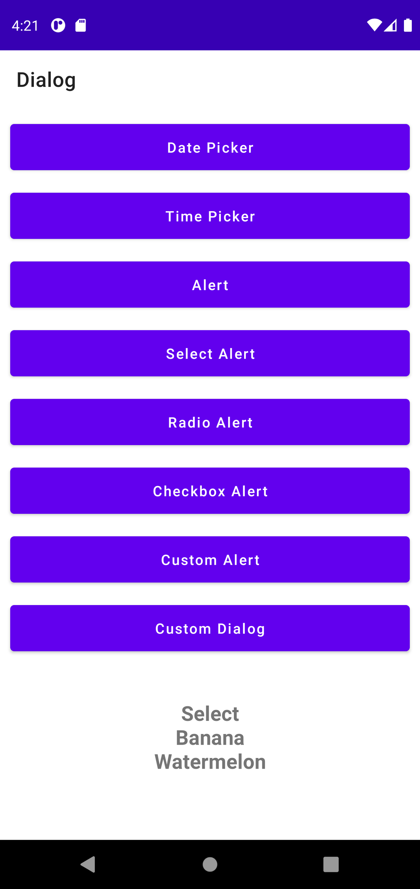

### CustomAlertDialog
* #### AlertDialog의 setView를 사용하여 만들 수 있다.
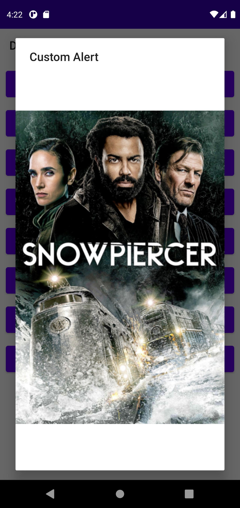

### CustomDialog
* #### DialogFragment를 상속받아서 만들 수 있다.
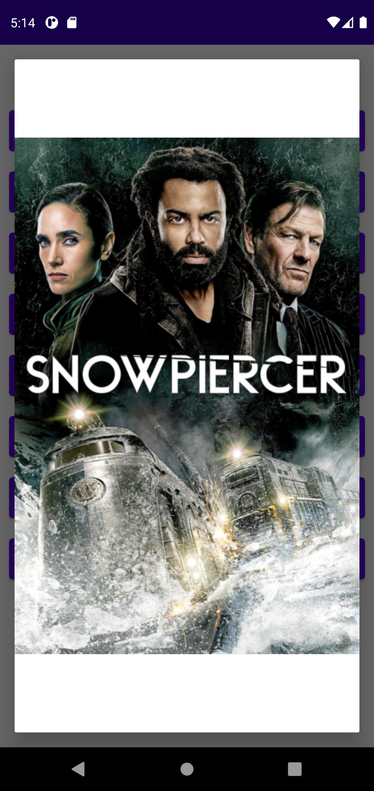