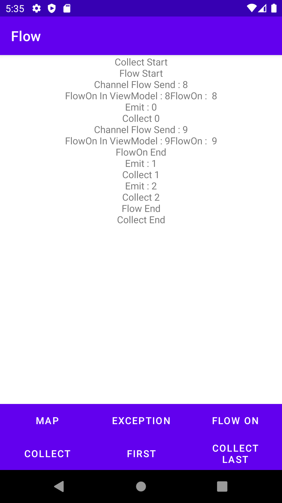
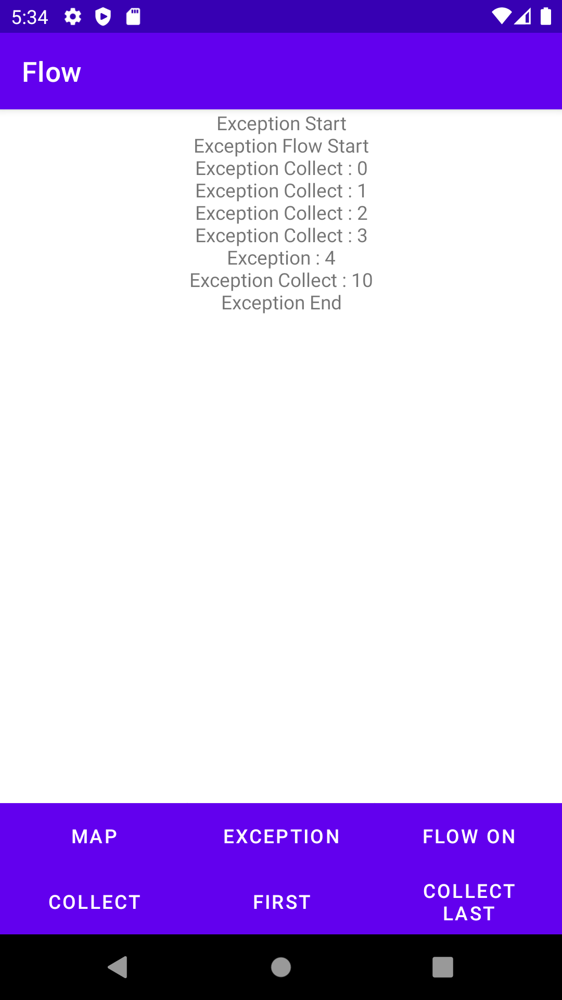
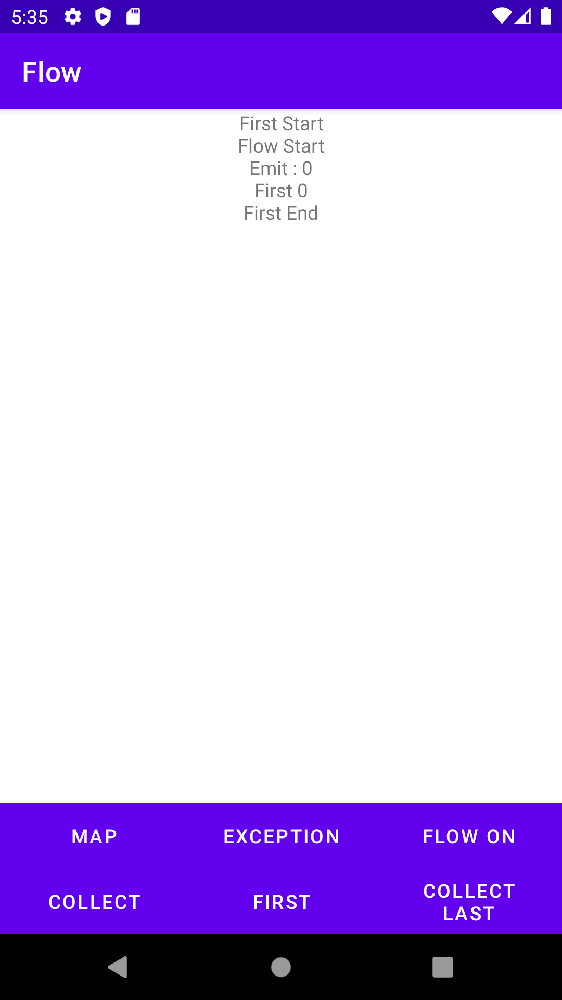
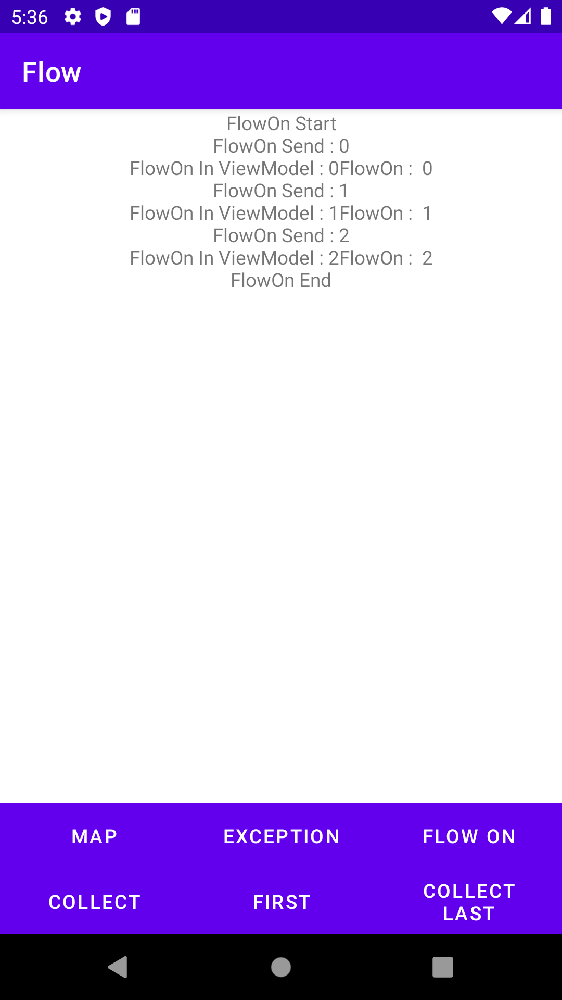
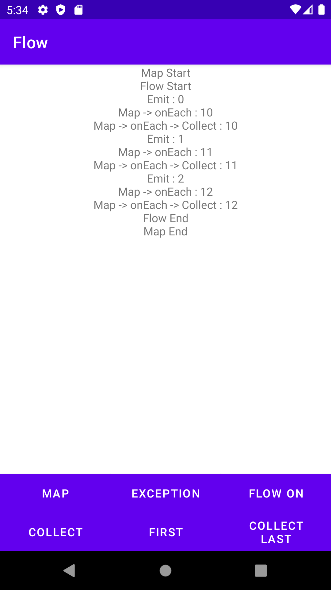

# Flow 예제

## ⚡ Features
* Producer(생성자) : Flow Builder를 통해 만든다. flow, channelFlow등 다양한 함수가 존재한다. Builder를 통해 Data를 만들고 emit을 통해 Data를 전달한다. Consume하는 함수가 수행될 때마다 Flow Builder가 수행되고 emit되는 값을 소비한다. (https://rkdxowhd98.tistory.com/195)

* Intermediary(중개자) : map, filter같은 람다 함수로 Flow에서 값을 수정할 수 있습니다. (https://rkdxowhd98.tistory.com/195)

* Consumer : single, first, collect 등 Flow에서 값을 받아서 사용한다. (https://rkdxowhd98.tistory.com/195)

* Exception Controll : 만약 Flow Builder에서 Exception이 발생한 경우, Flow Builder는 즉시 종료된다. 그리고 catch블록이 있으면 실행되는데 Flow를 수정할 수 있다. (https://rkdxowhd98.tistory.com/195)

* 다른 CoroutineContext에서 실행하기 : flowOn을 통해 Flow Builder의 CoroutineContext를 수정할 수 있다. (https://rkdxowhd98.tistory.com/195)

## 😊 Introduction
