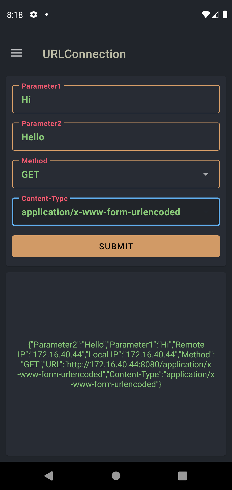
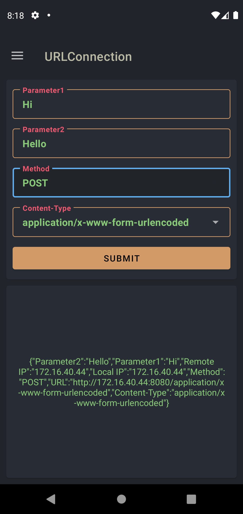
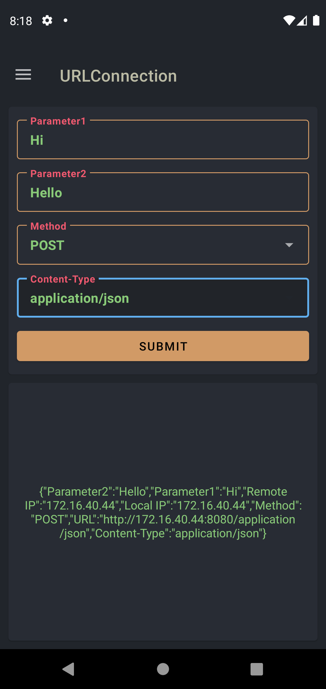
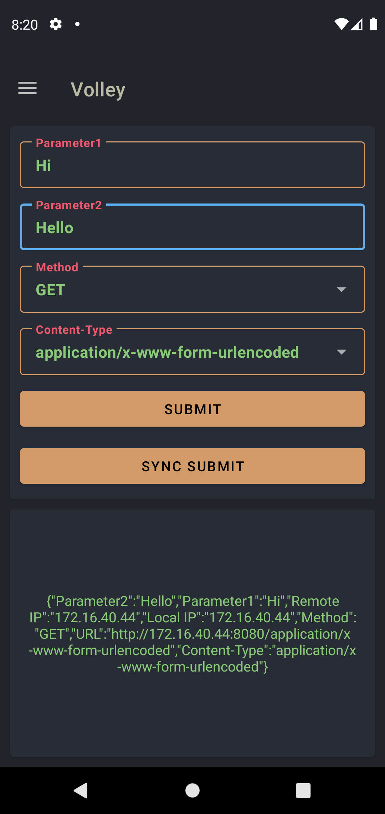
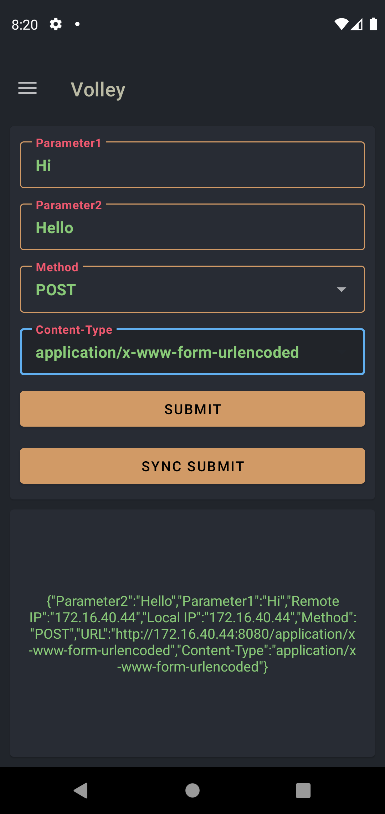
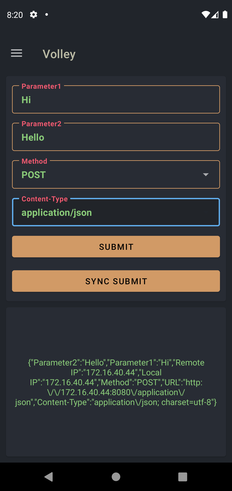

# HTTP 예제

## ⚡ Features
* URLConnection : Java의 URLConnection을 통해 GET, POST를 구현했습니다. (https://rkdxowhd98.tistory.com/139)

* Volley : Volley를 통해 GET, POST를 구현하고 비동기/동기 처리, Volley Policy 처리를 구현했습니다. (https://rkdxowhd98.tistory.com/140)

* Retrofit2 : Retrofit2를 통해 GET, POST를 구현하고 비동기/동기 처리, Gson을 이용한 DTO Mapping을 구현했습니다. (https://rkdxowhd98.tistory.com/141)

## 😊 Introduction
### URLConnectionFragment
* #### GET, POST, application/x-www-form-urlencoded, application/json 방식을 처리할 수 있도록 구현했습니다.
* #### connectTimeout, readTimeout를 통해 유연한 연결을 할 수 있습니다.

### VolleyFragment
* #### GET, POST, application/x-www-form-urlencoded, application/json 방식을 처리할 수 있도록 구현했습니다.
* #### StringRequest, JsonRequest를 통해 String형식의 Response와 Json형식의 Response를 처리했습니다.
* #### RequestFuture를 통해 동기 방식으로 처리했습니다.
* #### retryPolicy를 통해 유연한 연결을 할 수 있습니다.

### RetrofitFragment
* #### GET, POST, application/x-www-form-urlencoded, application/json 방식을 처리할 수 있도록 구현했습니다.
* #### ScalarsConverterFactory를 통해 String형식으로 Response를 처리했습니다.
* #### GsonConverterFactory를 통해 Gson으로 Response를 DTO로 Mapping하여 처리했습니다.
