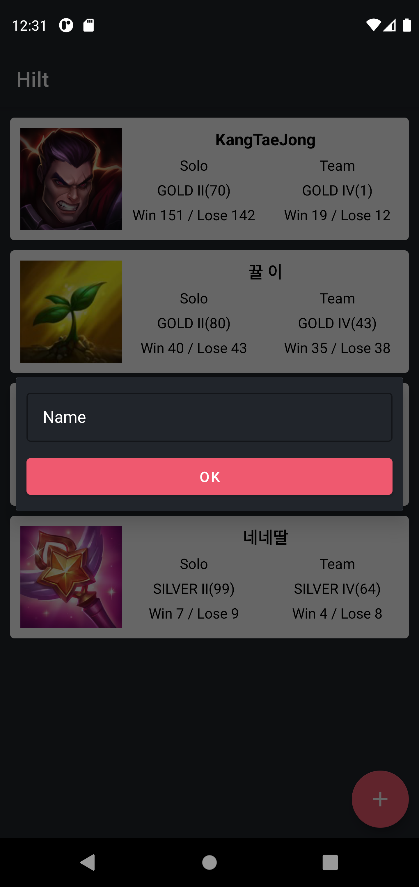

# Hilt 예제

## ⚡ Features
* Hilt : Hilt의 개념 및 DI(Dependency Injection) 개념 (https://rkdxowhd98.tistory.com/143)

* Hilt Module : Field Injection, Constructor Injection을 사용할 수 없을 때 Hilt Module을 통한 Injection (https://rkdxowhd98.tistory.com/144)

* Qualifier : Qualifier을 통한 동일한 유형에 대한 여러 결합을 제공할 때 처리 (https://rkdxowhd98.tistory.com/144)

* Hilt Componet : Hilt Component 구조와 Component의 생명주기 (https://rkdxowhd98.tistory.com/145)

* EntryPoint : Hilt에서 제공하지 않는 Class에 DI를 적용하는 방법 (https://rkdxowhd98.tistory.com/149)


## 😊 Introduction
### MainFragment
* #### Riot API를 사용하여 등록된 소환사의 전적을 확인할 수 있습니다.
* #### HiltViewModel을 통해 ViewModel을 Inject하여 등록된 소환사의 전적을 관리합니다.


### SummonerEntityViewModel
* #### @HiltViewModel을 통한 ViewModel Injection
```Kotlin
@HiltViewModel
class SummonerEntityViewModel @Inject constructor(
    summonerEntityRepository: SummonerEntityRepository,
    riotSpectatorAPI: RiotSpectatorAPI,
    riotLeagueAPI: RiotLeagueAPI,
    savedStateHandle: SavedStateHandle
) : ViewModel() {
    val summonerInformationLiveData = MutableLiveData<List<SummonerInformation>>(emptyList())

    init {
        summonerEntityRepository.findLiveData().apply {
            observeForever {
                viewModelScope.launch {
                val list = ArrayList<SummonerInformation>()
                    it.forEach { entity ->
                        try {
                            val summoner = riotSpectatorAPI.getSummoner(entity.name)
                            val leagueEntry = riotLeagueAPI.getLeagueEntry(summoner.id)

                            list.add(SummonerInformation(summoner, entity, leagueEntry).also { information ->
                                Log.d("PASS", information.toString())
                            })
                        } catch (e: Exception) {
                            Log.d("PASS", e.toString())
                            summonerEntityRepository.deleteSummonerEntity(entity)
                        }
                    }

                    withContext(Dispatchers.Main) {
                        summonerInformationLiveData.value = list
                    }
                }
            }
        }
    }
}
```