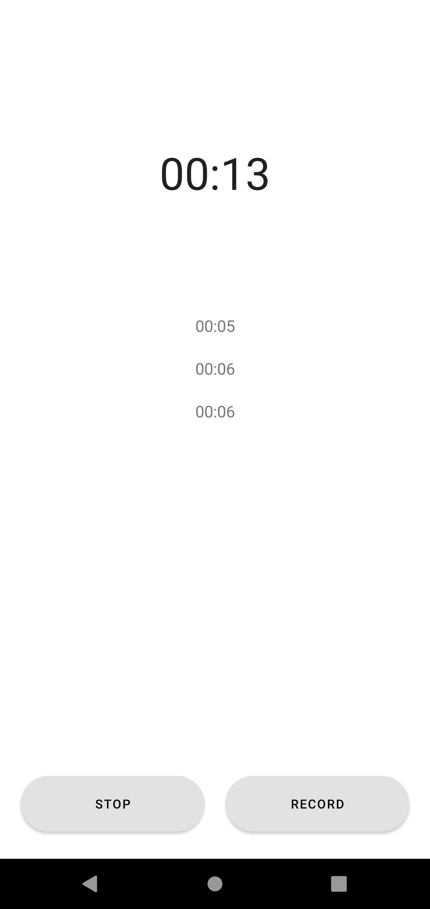
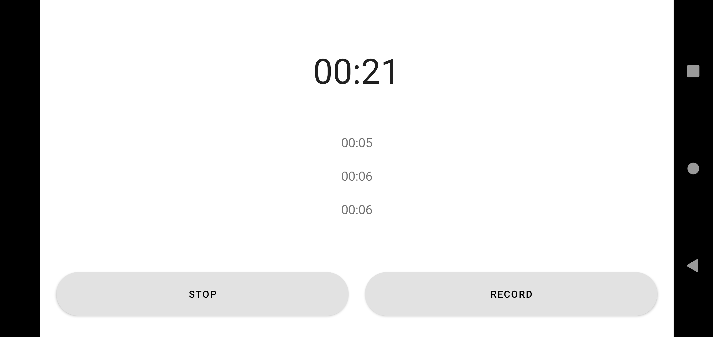
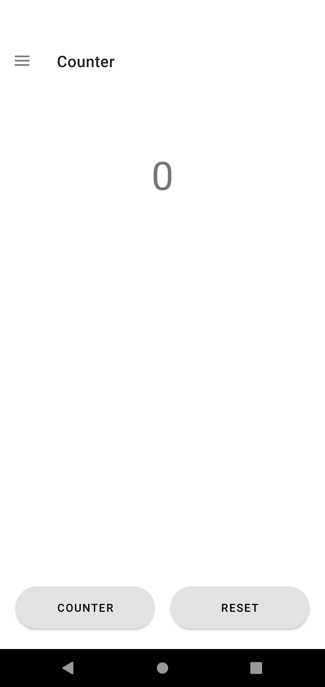
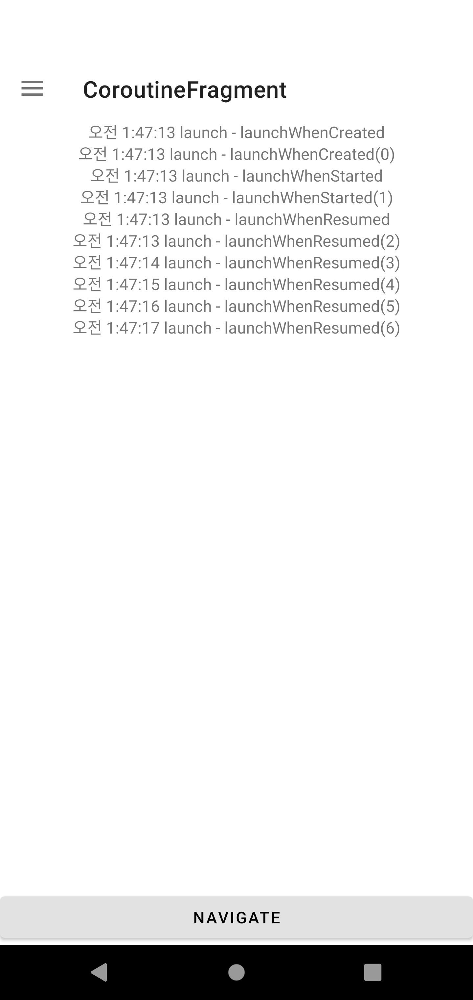
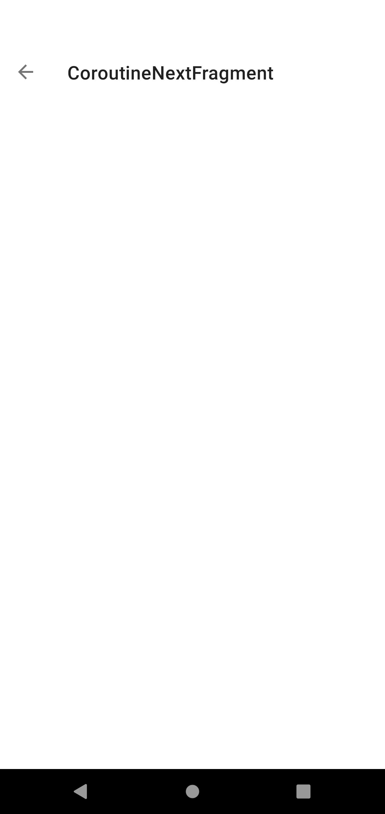
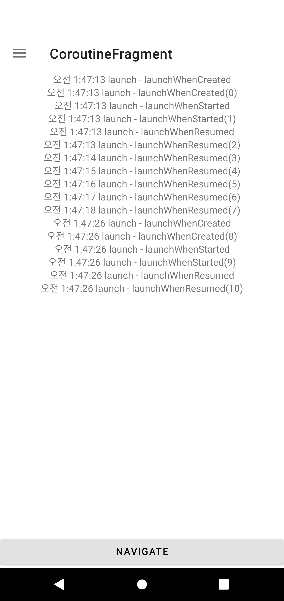

# Lifecycle 예제

## ⚡ Features
* ViewModel : ViewModel을 사용하여 MainActivity에서 Configure Change가 발생해도 Chronometer의 데이터를 유지시켰습니다. (https://rkdxowhd98.tistory.com/123)

* ViewModelProvider : ViewModelProvider를 사용하여 생성자가 있는 ViewModel의 생성법과 ViewModelProvider를 통해 ViewModel을 얻는 과정을 설명했습니다. (https://rkdxowhd98.tistory.com/125)

* LiveData : Chronometer의 State를 LiveData로 관리하여 start, stop을 관리했습니다. (https://rkdxowhd98.tistory.com/126)

* ViewModel with SavedStateHandle : ViewModel은 메모리에 저장하기 때문에 Android Framework가 메모리를 회수하면 저장된 값을 잃습니다. ViewModel과 SavedStateHandle을 사용하여 메모리를 회수당해도 저장된 값을 얻을 수 있습니다. (https://rkdxowhd98.tistory.com/146)

* Scope : ViewModelScope와 LifeCycleScope를 통해 작업의 범위를 제한하여 자원을 적절하게 사용할 수 있습니다. (https://rkdxowhd98.tistory.com/147)

## 😊 Introduction
### ChronometerFragment
* #### ViewModel과 LiveData를 통해 Chronometer의 Data를 관리했습니다.
* #### 시작/중지 기능과 기록 기능을 추가했습니다.

### CounterFragment
* #### ViewModel과 SavedStateHandler을 사용하여 Android Framework에 의해 Memory가 반납되도 값을 저장하도록 구현했습니다.

### CoroutineFragment
* #### LifecycleScope을 이용하여 Active일 때만 Log를 작성하도록 구현했습니다.
