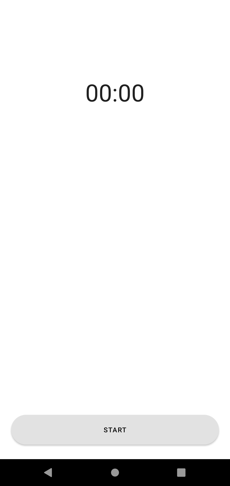
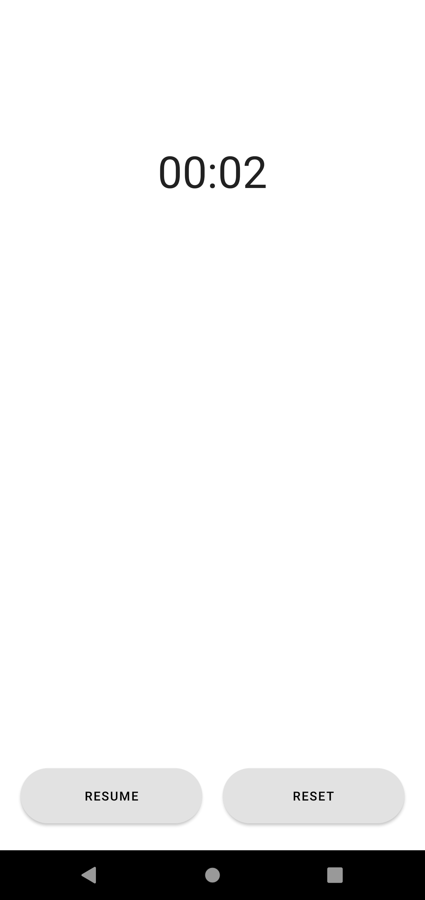

# LifeCycle 예제

## ⚡ Features
* ViewModel : ViewModel을 사용하여 MainActivity에서 Configure Change가 발생해도 Chronometer의 데이터를 유지시켰습니다. (https://rkdxowhd98.tistory.com/123)

* ViewModelProvider : ViewModelProvider를 사용하여 생성자가 있는 ViewModel의 생성법과 ViewModelProvider를 통해 ViewModel을 얻는 과정을 설명했습니다. (https://rkdxowhd98.tistory.com/125)

* LiveData : Chronometer의 State를 LiveData로 관리하여 start, stop을 관리했습니다. (https://rkdxowhd98.tistory.com/126)

## 😊 Introduction
### MainActivity
* #### ViewModel과 LiveData를 통해 Chronometer의 Data를 관리했습니다.
* #### 시작/중지 기능과 기록 기능을 추가했습니다.

