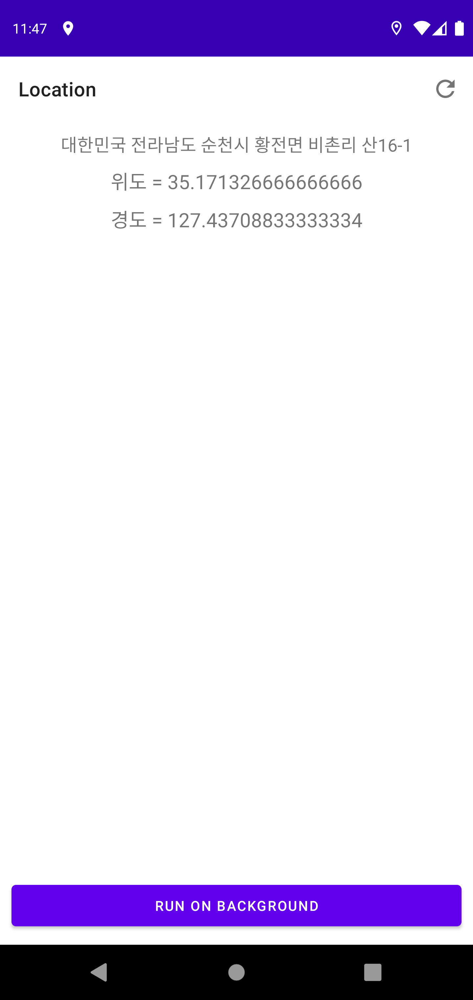
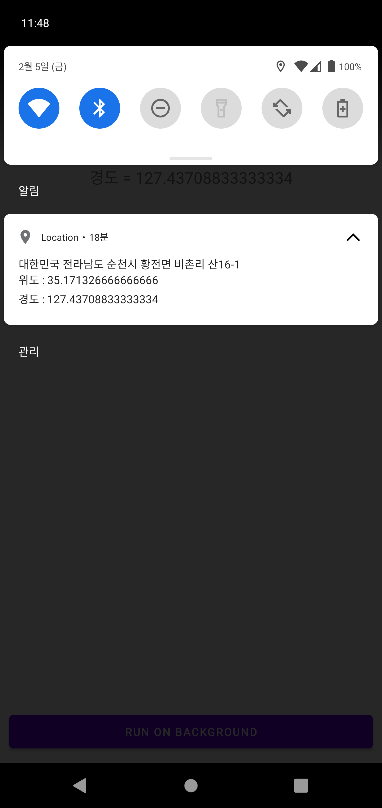

# LifeCycle 예제

## ⚡ Features
* 위치서비스 : Android LocationManager를 통해 GPS Provider와 Network Provider를 사용하여 백그라운드, 포그라운드 위치 정보를 얻었습니다. (https://rkdxowhd98.tistory.com/127)

* GPSManager : GPSManager를 Singleton Pattern을 적용하여 구현하고 쉽게 위치 정보를 받을 수 있도록 코딩했습니다.

## 😊 Introduction
### MainActivity
* #### Singleton Pattern으로 구현된 GPSManager를 통해 Foreground 위치 정보를 수신했습니다.

### Notification
* #### Background 위치 정보와 requestLocationupdates를 통해 실시간으로 업데이트 되는 위치 정보를 수신했습니다.
