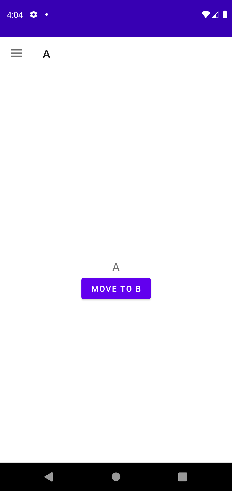
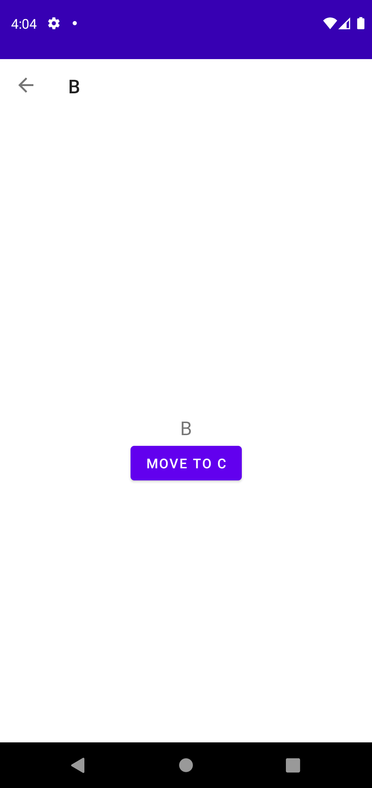
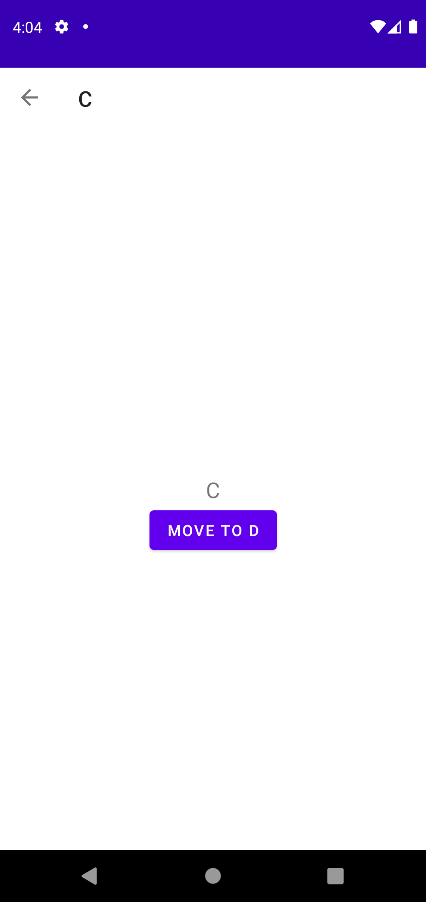
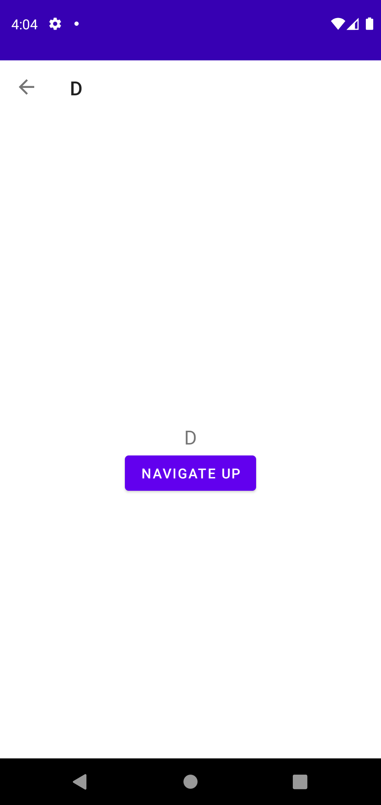
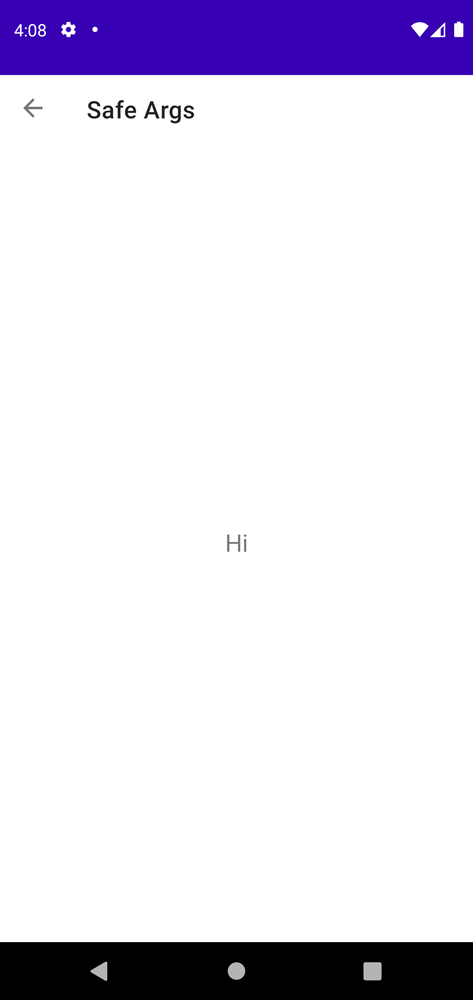
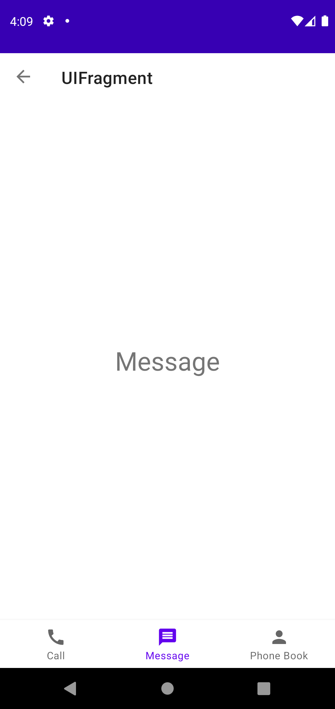
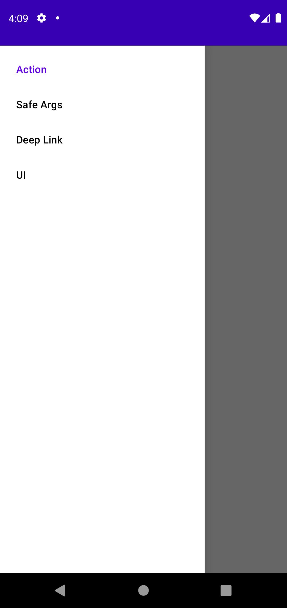

# Navigation 예제

## ⚡ Features
* Action : startActivity와 비슷한 기능으로 Navigation UI 대상간의 이동을 지원한다. (https://rkdxowhd98.tistory.com/152)

* Animation : Navigation UI 대상간 이동할 때 Animation을 쉽게 적용할 수 있다. (https://rkdxowhd98.tistory.com/152)

* SafeArgs : startActivity에서 Intent를 통해 값을 전달할 때 Key값에 String을 입력하는 과정에서 오류가 발생할 수 있고, 객체를 불러오는 과정에서 형변환을 실수할 가능성이 있다. 이를 SafeArgs로 자료형을 정의하고 유형 안정성을 보장할 수 있다. (https://rkdxowhd98.tistory.com/153)

* Material Design : Material Design 요소(NavigationView, BottomNavigationView, Toolbar, Menu 등)에 쉽게 Navigation을 쉽게 적은 코드로 연결할 수 있다. (https://rkdxowhd98.tistory.com/154)

## 😊 Introduction
### Action
* #### Pop Behavior를 사용하여 A -> B -> C -> D 상태에서 NavigationUp하면 A로 가도록 설정했습니다.
* #### Navigation Animation을 통해 Navigation UI간 이동에 Animation을 쉽게 적용할 수 있습니다.

### SafeArgs
* #### SafeArgs를 사용하여 Navigation UI간 이동에서 값을 전달햇습니다.

### Material Design
* #### Material Design 요소와 Navigation을 결합했습니다.

