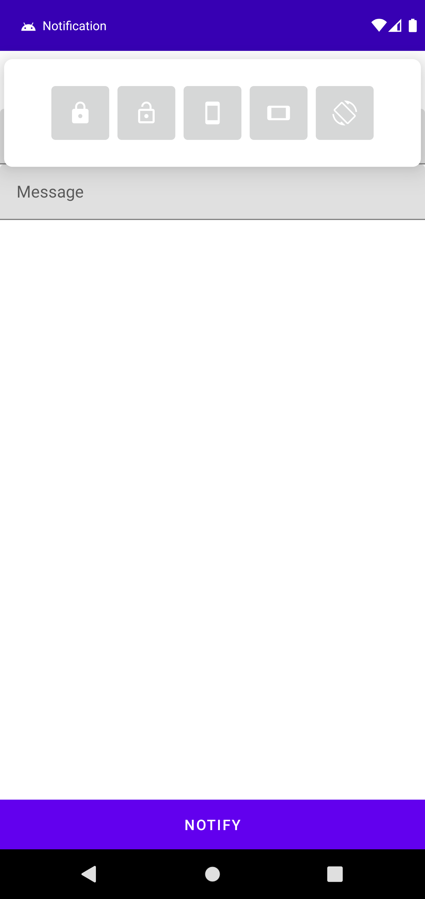
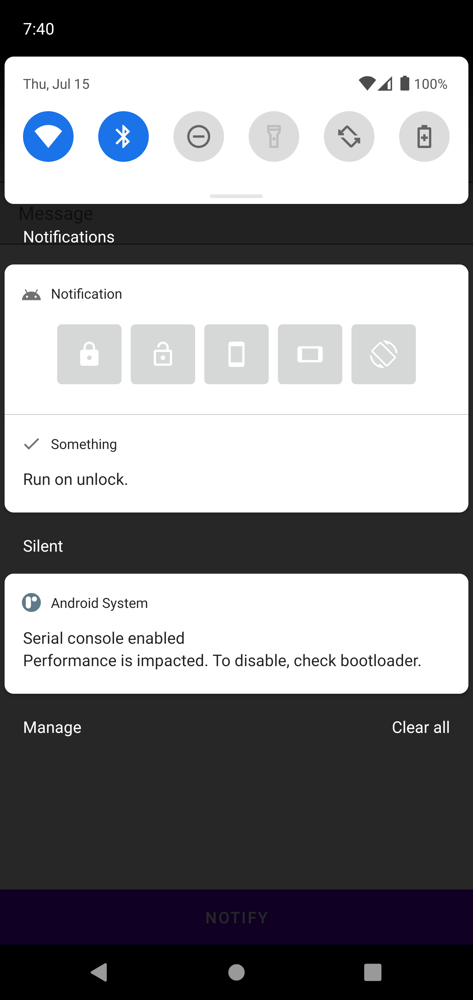

# Notification 예제

## ⚡ Features
* Notification : 기본적인 Notification 생성 방법, Notification Channel, 구성 요소등을 사용. (https://rkdxowhd98.tistory.com/188)

* Notification Action : Notification을 클릭했을 때 PendingIntent 실행과 addAction을 통해 Action을 추가하여 사용. (https://rkdxowhd98.tistory.com/189)

* Notification Extend : Notification을 확장하여 더 많은 정보를 제공하는 알림 사용 (https://rkdxowhd98.tistory.com/190)

* Notification Group : Notification Group을 사용하여 여러 알림이 왔을 때 요약해서 표현할 수 있다. (https://rkdxowhd98.tistory.com/191)

* Notification Custom : Android 기본 알림으로 요구 조건을 충족하지 못 할 때 RemoteViews를 통해 새로운 템플릿을 만들 수 있다. (https://rkdxowhd98.tistory.com/192)

## 😊 Introduction
### Custom Notification
* #### RemoteViews를 통해 Custom Notification을 만들 수 있다.
* #### System 설정을 통해 자동회전, 자동회전 잠금, Portrait, LandScape 등 회전 모드를 설정할 수 있다.
