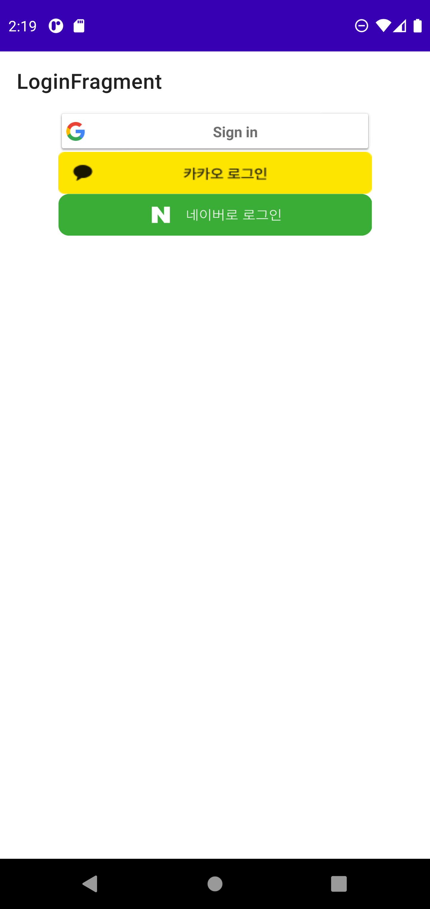
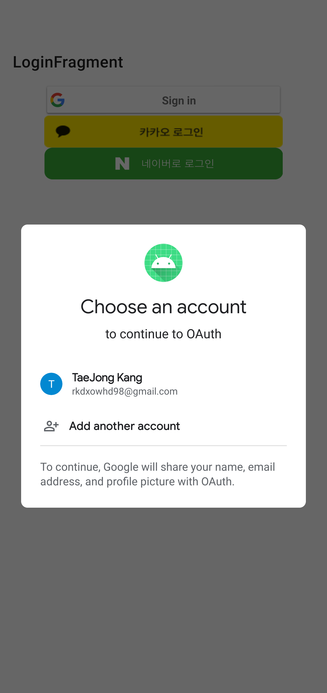
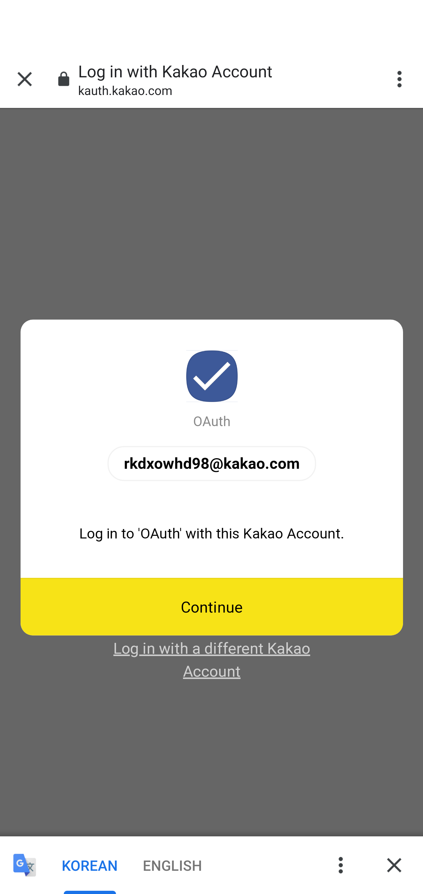
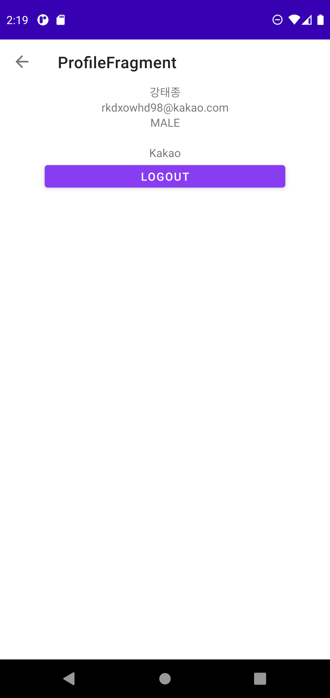

# OAuth 예제

## ⚡ Features
* OAuth Google : Google Access Token을 발급 받을 수 있다. (https://rkdxowhd98.tistory.com/168)

* People API : Google Access Token을 사용하여 Google 계정의 정보를 받을 수 있다.  (https://rkdxowhd98.tistory.com/170)

* OAuth Kakao : Kakao OAuth를 사용하여 정보를 받아올 수 있다. (https://rkdxowhd98.tistory.com/171)

* OAuth Naver : Naver OAuth를 사용하여 정보를 받아올 수 있다. (https://rkdxowhd98.tistory.com/172)

## 😊 Introduction
### LoginFragment
* #### OAuth를 사용하여 로그인할 수 있습니다.

### ProfileFragment
* #### OAuth를 통해 Token을 획득하여 정보를 받아올 수 있다.

