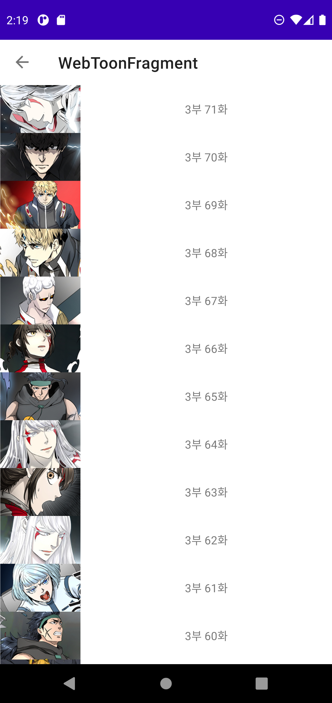
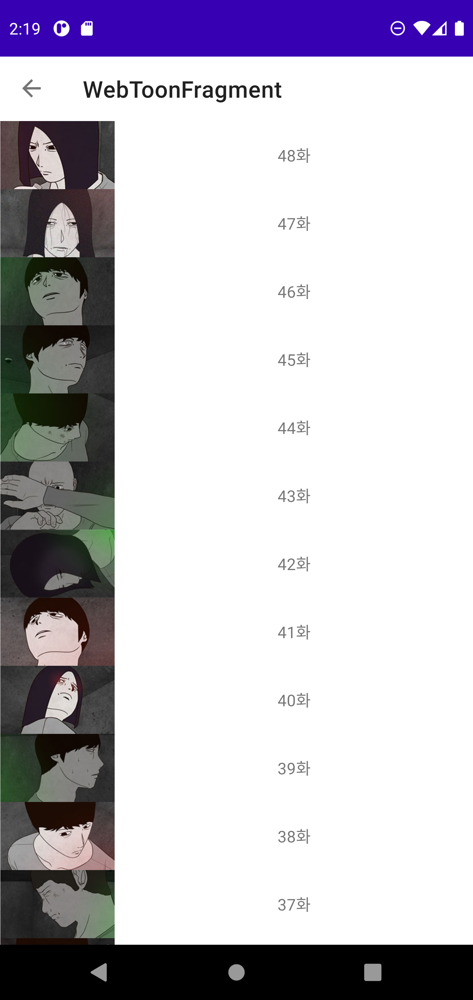

# RecyclerView 예제

## ⚡ Features
* Paging Source : 데이터를 얻는 방법을 정의한다. 로컬 데이터베이스에서 얻거나 서버로붙 받아온다. (https://rkdxowhd98.tistory.com/177)

* Pager : PagingConfig와 Paging Source에서 얻은 데이터를 PagingData로 만들어 Flow로 반환한다.  (https://rkdxowhd98.tistory.com/178)

* PagingAdapter : RecyclerView와 연동하여 Paging을 사용할 수 있다. (https://rkdxowhd98.tistory.com/179)

## 😊 Introduction
### MainFragment
* #### Naver WebToon을 ViewPager를 사용하여 요일별로 볼 수 있다.

### WebToonFragment
* #### WebToon Episode를 볼 수 있다.

### ViewerFragment
* #### Paging을 사용하여 WebToon을 정주행할 수 있다.
