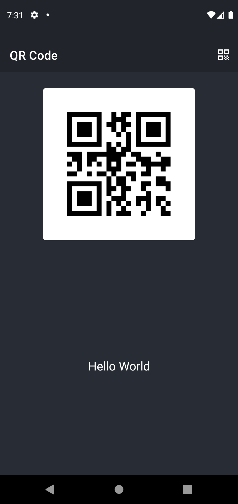
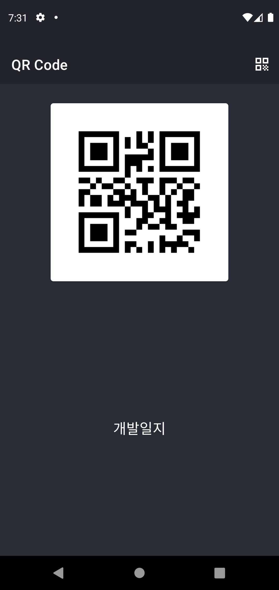
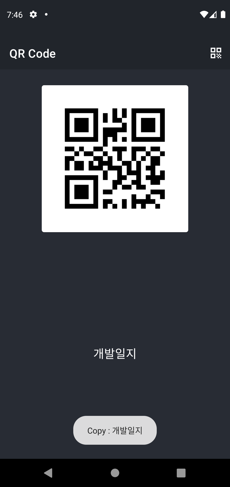
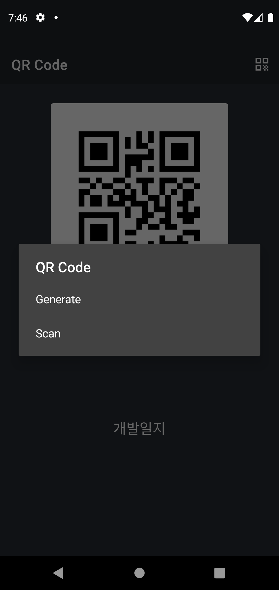
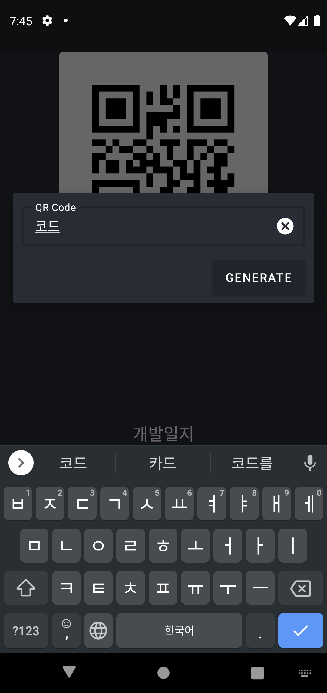
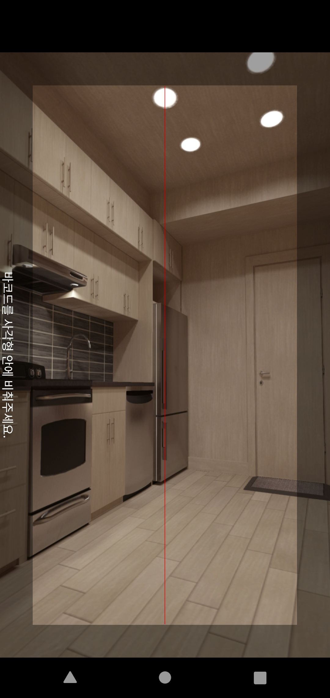

# QR Code 예제

## ⚡ Features
* Generate : zxing 오픈소스를 이용하여 QR Code를 만들 수 있고, ISO 8859-1 코드를 사용하여 한국어도 지원합니다. (https://rkdxowhd98.tistory.com/142)

* Scan : zxing 오픈소스를 이용하여 QR Code를 스캔할 수 있습니다. (https://rkdxowhd98.tistory.com/142)

* Copy : ClipboardManager를 통해 QR Code나 TextView를 클릭시 복사하도록 하였습니다. (https://rkdxowhd98.tistory.com/142)

## 😊 Introduction
### MainFragment
* #### ImageView를 통해 QR Code를 보여주고 클릭시 ClipboardManager를 통해 QR Code를 복사합니다.
* #### TextView를 통해 QR Code의 값을 보여주고 클릭시 ClipboardManager를 통해 QR Code를 복사합니다. 그리고 textIsSelectable 속성을 이용하여 부분적으로 복사할 수 있습니다.

### MainFragment OptionMenu
* #### QR Code 아이콘의 OptionMenu를 선택하면 Generate와 Scan을 할 수 있습니다.
* #### Jetpack Navigation을 통해 Dialog 형식으로 GenerateDialog와 ScanDialog를 호출합니다.

### GenerateDialog
* #### 입력한 값을 QR Code로 바꿔줍니다.

### ScanDialog
* #### Scan한 값을 ImageView를 통해 QR Code를 보여주고 TextView를 통해 QR Code의 값을 보여줍니다.

