# RecyclerView 예제

## ⚡ Features
* ViewHolder Pattern : ChatFragment에 MyChatHolder, OtherChatHolder를 만들어서 사용했습니다. (https://rkdxowhd98.tistory.com/91)

* LayoutManager : GalleryFragment에 GridLayout을 사용하여 Gallery앱 형태를 만들었습니다. (https://rkdxowhd98.tistory.com/92)

* ItemDecoration : RecyclerView.ItemDecoration을 상속받아 ViewHolder에 간격을 주는 GridSpacingItemDecoration, 구분선을 주는 DivisionItemDecoration을 구현했습니다. (https://rkdxowhd98.tistory.com/95)

* ItemTouchHelper : ToDoFragment에서 ItemTouchHelper를 사용하여 ViewHolder에 Swipe, Drag에 대한 이벤트 처리를 구현했습니다. (https://rkdxowhd98.tistory.com/93)

* AdapterDataObsever : Adapter에서 데이터의 변화가 생겼을 때 콜백을 받을 수 있는 기능입니다. (https://rkdxowhd98.tistory.com/94)

* setHasStableIds : Adapter에 각 Item이 고유한 Id를 가지고 있다고 설정하는 함수입니다. (https://rkdxowhd98.tistory.com/96)

* setHasFixedSize : RecyclerView가 고정된 Size를 가지고 있다고 설정하는 함수입니다. (https://rkdxowhd98.tistory.com/97)

* Payload : ToDoFragment에서 완료된 ToDo를 Payload를 사용하여 처리했습니다. (https://rkdxowhd98.tistory.com/98)

* Selection : SelectionFragment에서 ViewHolder를 선택하는 이벤트를 처리하는 기능을 구현했습니다. (https://rkdxowhd98.tistory.com/99)

* Selection(Predicate) : SelectionTracker에서 Select에 조건(개수 제한, 특정 ViewHolder만 선택가능 등등)을 줄 수 있습니다. (https://rkdxowhd98.tistory.com/100)

* Selection(Observer) : SelectionTracker에서 Selection에 Observer를 통하여 콜백함수를 작성할 수 있습니다. (https://rkdxowhd98.tistory.com/101)

* SnapHelper : RecyclerView를 ViewPager처럼 쓰거나 Scroll시 하나의 Item 자석처럼 끌어당겨 선택하는 효과를 줄 수 있습니다. (https://rkdxowhd98.tistory.com/116)

## 😊 Introduction
### ChatFragment
* #### MyChatHolder와 OtherChatHolder로 채팅을 구분, notifyItemInserted로 채팅을 추가
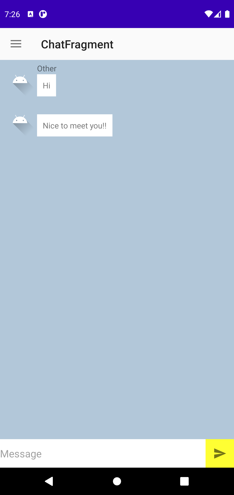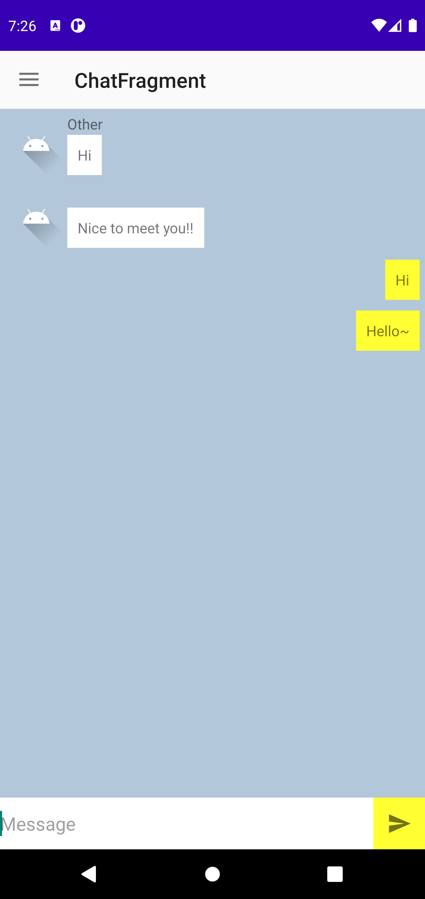

### GalleryFragment
* #### CardView와 GridLayoutManager을 사용해서 Gallery앱을 구현
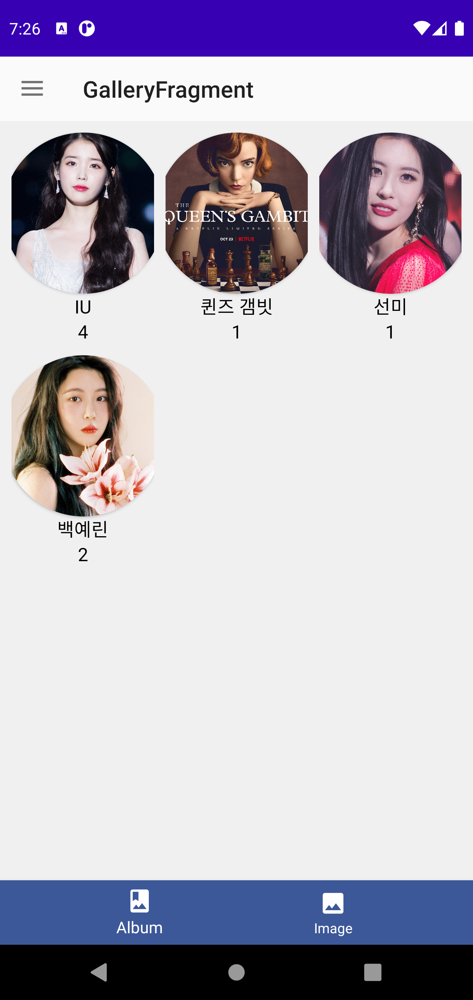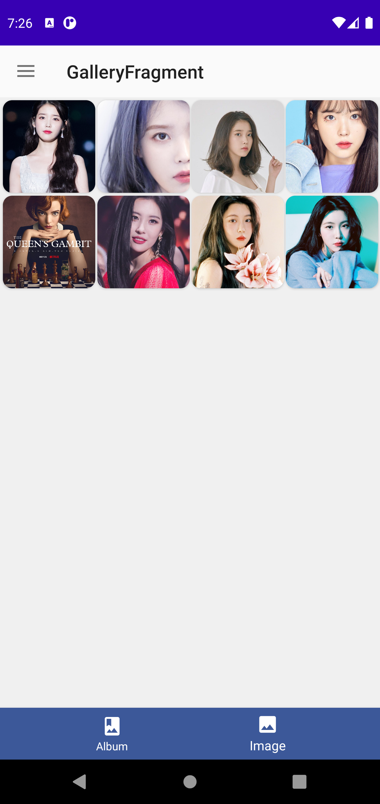

### ToDoFragment
* #### Payload기능으로 ToDo 클릭시 체크표시 애니메이션 추가, 새로고침 누르면 모든 ToDo 체크표시 해제
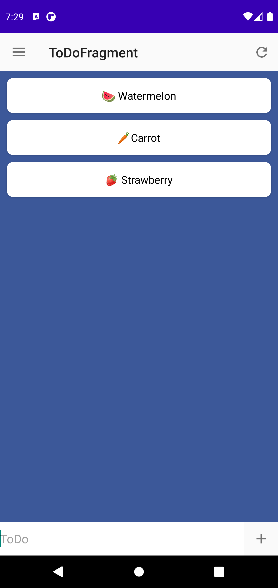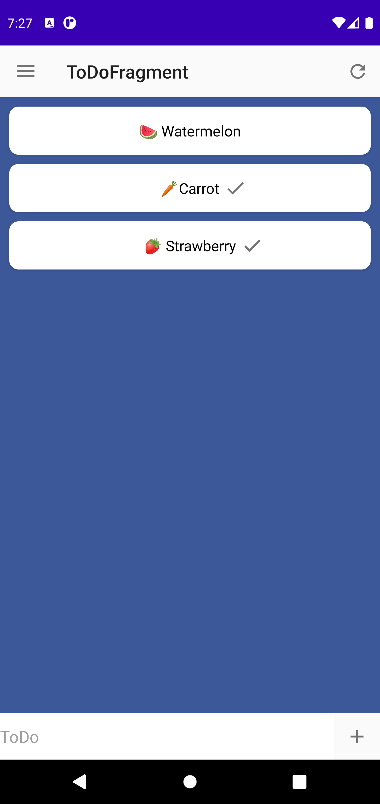

### SelectionFragment
* #### SelectionTracker를 사용하여 ViewHolder 선택기능 추가
* #### SelectionPredicate를 사용하여 특정 ViewHolder만 선택가능하게 구현
* #### SelectionObserver를 사용하여 Selection 활성화시 DeleteMenu 표시되게 구현
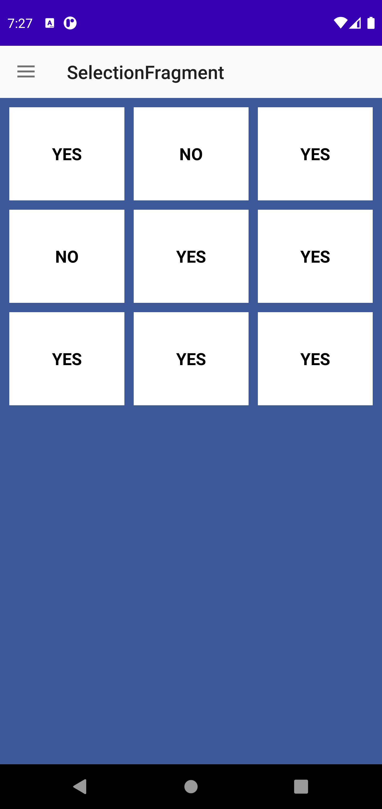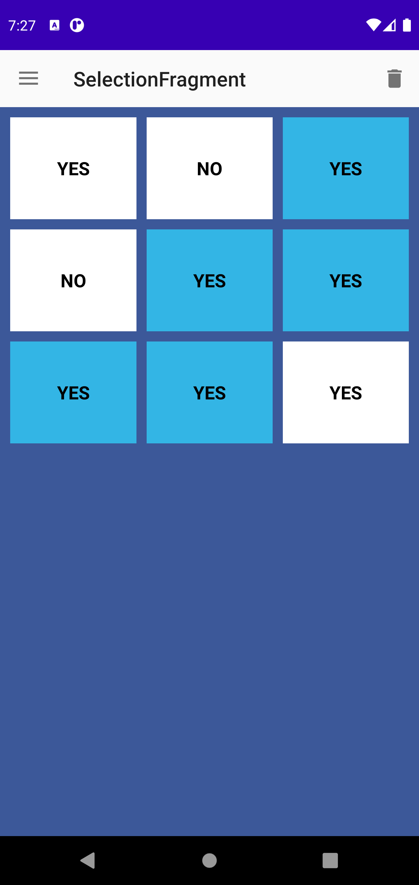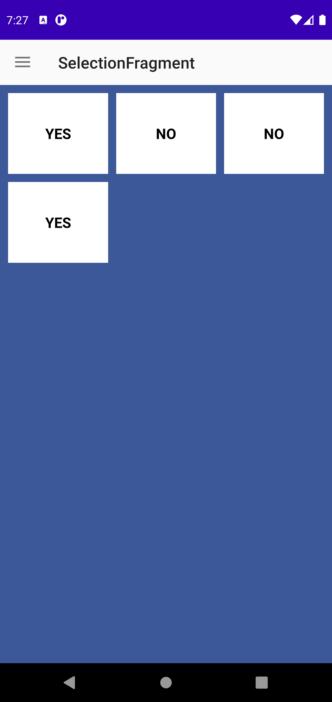
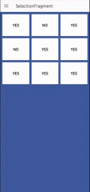

### SnapHelperFragment
* #### LinearSnapHelper와 OnScrollListener를 사용하여 SnapHelper가 선택한 Item의 Position을 확인했습니다.
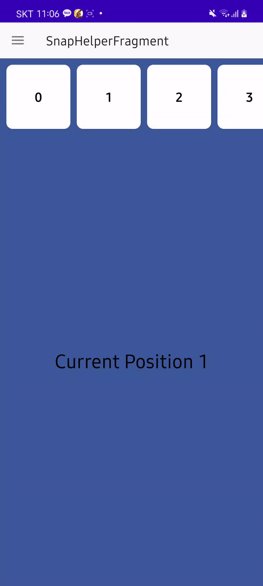