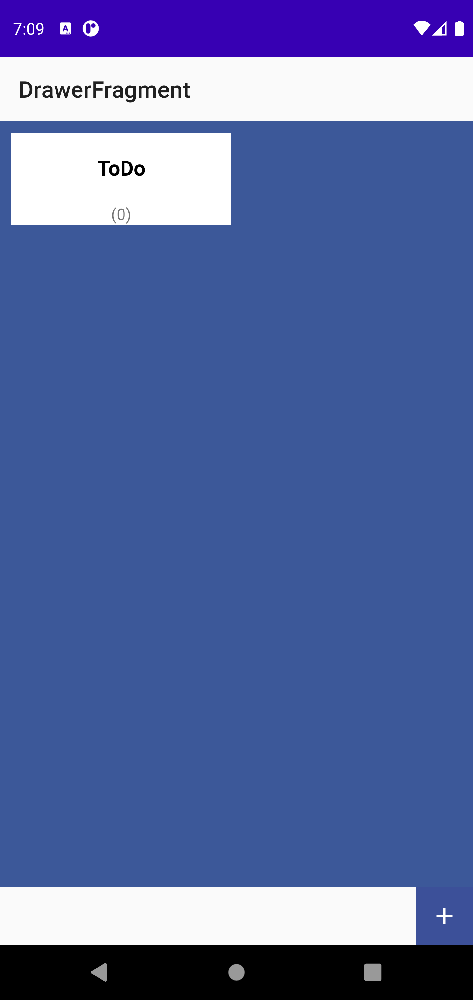
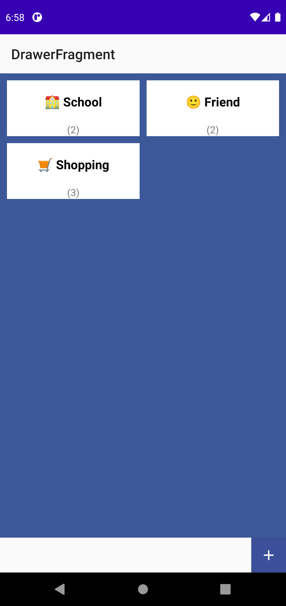
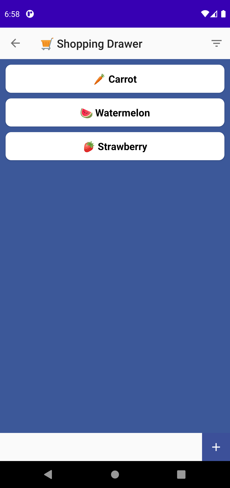

# Room 예제

## ⚡ Features
* addCallback : Callback을 사용하여 데이터베이스가 create, open, migration될 때 처리, 데이터 미리 채우기등 이벤트를 구현했습니다. (https://rkdxowhd98.tistory.com/103)

* Migration : 데이터베이스의 Scheme가 변경시 Migration을 통하여 업데이트하는 코드를 구현했습니다. (https://rkdxowhd98.tistory.com/104)

* Relation : Room에서 Entity간의 관계를 설정했습니다. (https://rkdxowhd98.tistory.com/105)

* TypeConvert : Room에서 제공하지 않는 Type을 TypeConverter로 저장했습니다. (https://rkdxowhd98.tistory.com/107)

* Minimal : 리소스를 아끼기 위해 Minimal한 Class를 만들어서 필요한 데이터만 불러왔습니다. (https://rkdxowhd98.tistory.com/108)

## 😊 Introduction
### DrawerFragment
* #### Drawer의 이름을 표시하고 Drawer에 포함된 ToDo의 갯 수를 표현했습니다. (관계를 이용하여 Drawer에 포함된 ToDo를 구함)
* #### RecyclerView Selection을 사용하여 Drawer를 삭제하는 기능을 넣었습니다. (관계를 이용하여 Drawer에 포함된 ToDo전부 삭제)

### ToDoFragment
* #### navigation을 사용하여 Drawer 클릭시 Drawer의 name을 전달하여 해당 Drawer에 속하는 ToDo를 표현했습니다.
* #### ItemTouchHelper를 이용하여 완료되지 않은 ToDo를 Swipe하면 완료된으로 바꾸고, 완료된 ToDo를 좌로 Swipe하면 복구, 우로 Swipe하면 삭제로 구현했습니다.
* #### DataBindingAdapter를 사용하여 완료된 ToDo는 Text에 가운데 선을 넣었습니다.
