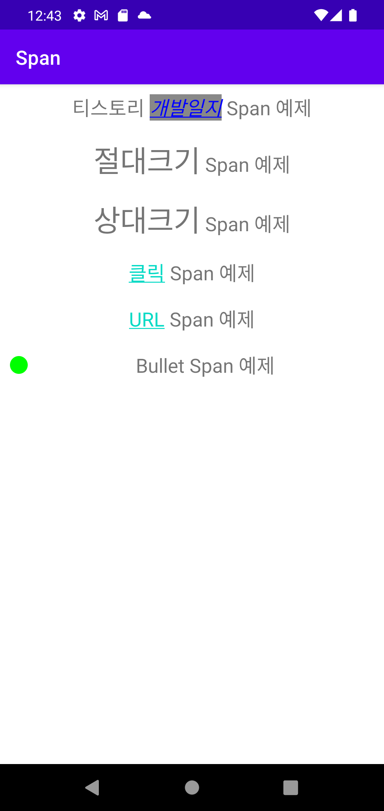

# RecyclerView 예제

## ⚡ Features
* Span : Span은 TextView에 텍스트를 표현할 때 스타일을 입힐 수 있도록 도와줍니다. 예를 들면 색상, 크기, 폰트 등 다양한 옵션이 존재합니다. (https://rkdxowhd98.tistory.com/203)

* Span Class : Spanned와 Spannable에서 파생된 Class 비교 (https://rkdxowhd98.tistory.com/203)

* Span 유형 : AbsoluteSizeSpan, BackgroundColorSpan 등 다양한 Span (https://rkdxowhd98.tistory.com/203)

## 😊 Introduction
