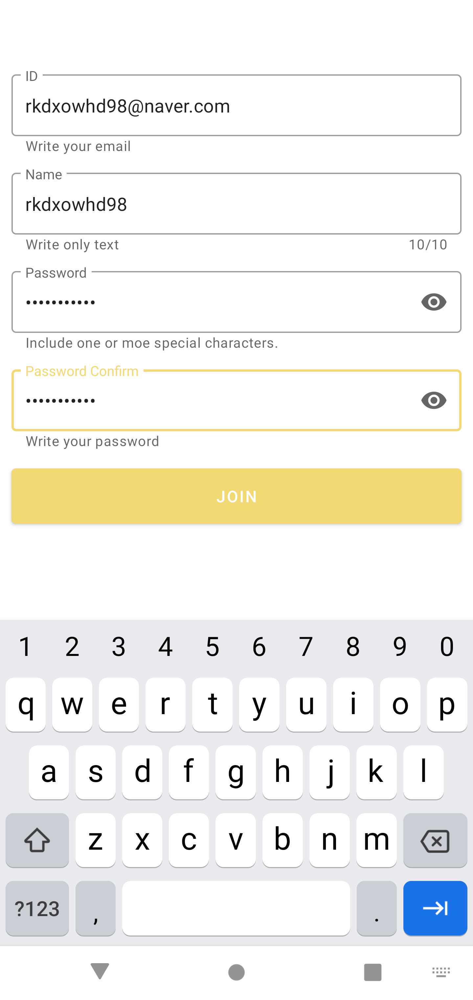
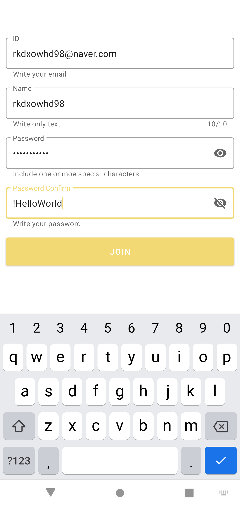
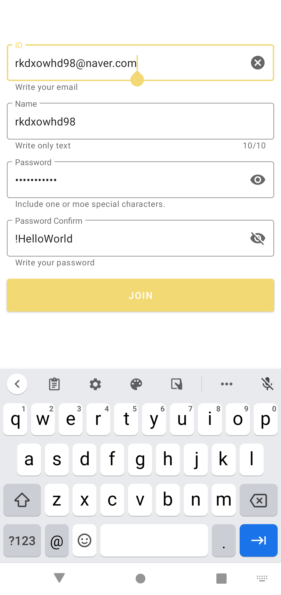
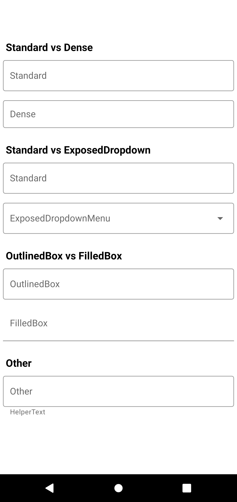
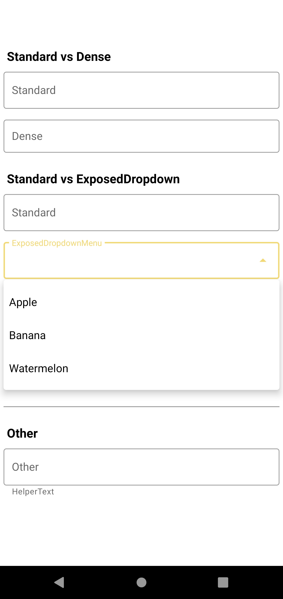
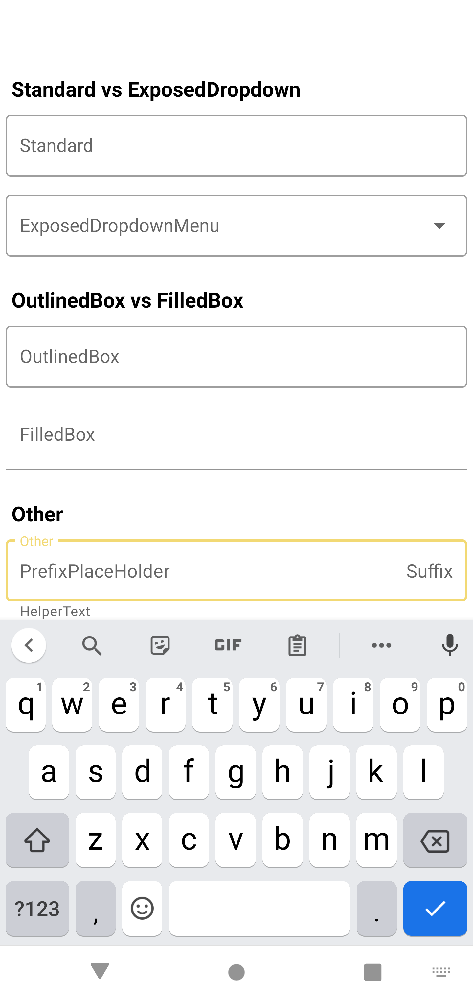

# TextInputLayout 예제

## ⚡ Features
* hint : TextInputLayout을 사용하여 EditText에 hint를 에니메이션을 통해 반응하도록 만들었습니다.

* helperText : TextInputLayout을 사용하여 EditText아래에 설명을 표시했습니다.

* prefixText : TextInputLayout을 사용하여 EditText에 접두사를 표시했습니다.

* suffixtext : TextInputLayout을 사용하여 EditText에 접미사를 표시했습니다.

* placeHolderText : TextInputLayout을 사용하여 EditText에 자리 표시자를 표시했습니다.

* counterMaxLength TextInputLayout을 사용하여 EditText에 최대 글자수를 표시했습니다.

* endIconMode : TextInputLayout을 사용하여 clear_text, password_toggle을 구현했습니다.

* OutlinedBox : TextInputLayout을 사용하여 hint를 Outline에 표시했습니다.

* FilledBox : TextInputLayout을 사용하여 hint를 Box안에 표시했습니다.

## 😊 Introduction
### JoinActivity
* #### 정규식을 사용하여 회원가입시 아이디 형식, 비밀번호 형식에 맞게 입력하도록 구현했습니다.

### MainActivity
* #### JoinActivity에서 다루지 못한 FilledBox와 ExposedDropdownMenu를 구현했습니다.
