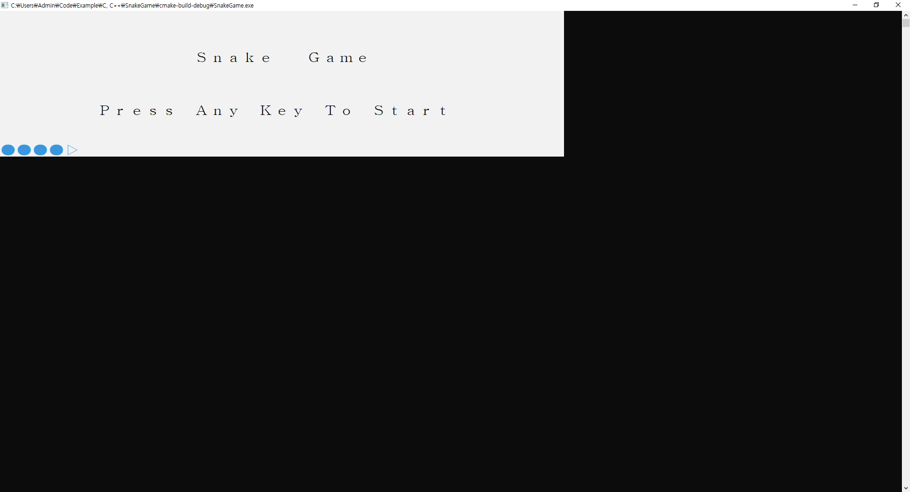
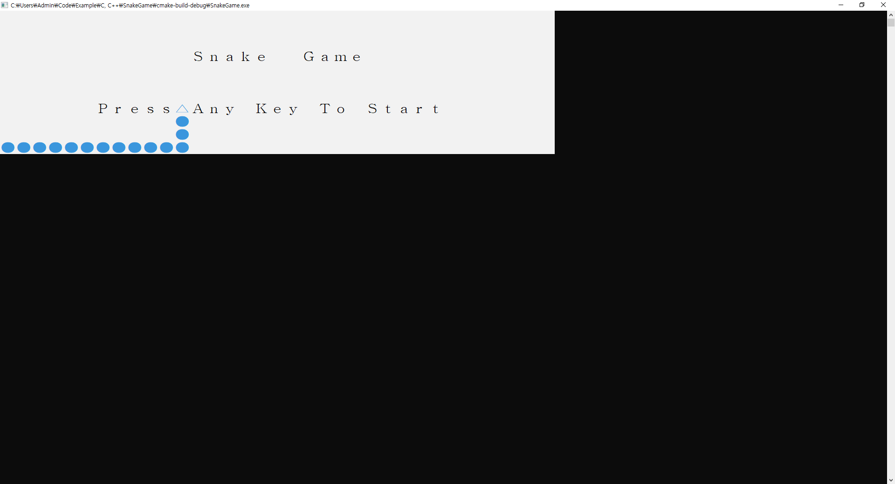
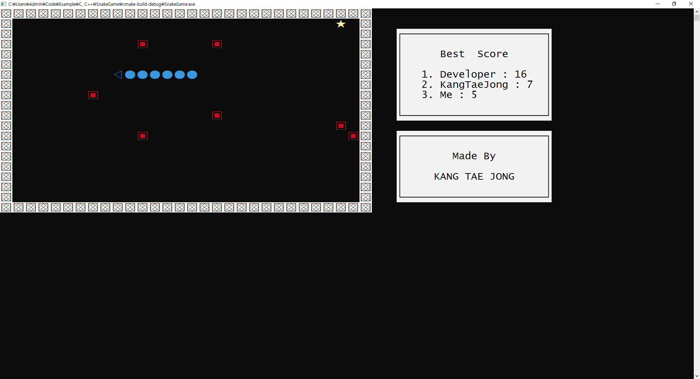
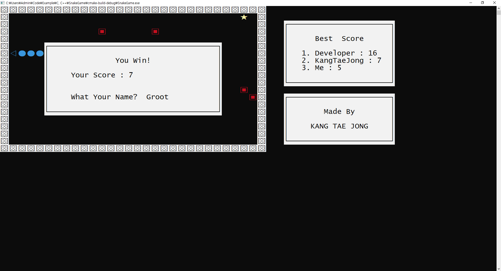
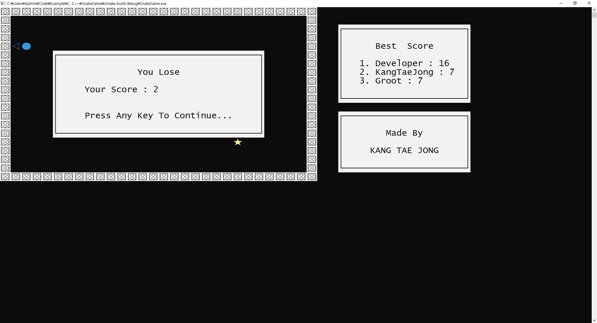

# SnakeGame (C언어 과제)

## ⚡ Features
* 랭킹 시스템
- txt파일을 통해 3위까지 제공

* 블록
- `★` : 코인 -> 획득하면 몸의 길이가 늘어남
- `▣` : 구멍 -> 부딪히면 게임패배
- `▩` : 벽   -> 부딪히면 게임패배

* 게임의 난이도를 위해 몸의 길이가 늘어나면 뱀의 이동속도가 빨라진다.

## 😊 Introduction
### Intro Screen
#### 뱀의 움직이는 에니메이션을 추가했고, 뱀이 벽에 부딪힐 때까지 시작을 안하면 게임을 종료한다.

### Play Screen

### Win Dialog

### Lose Dialog

